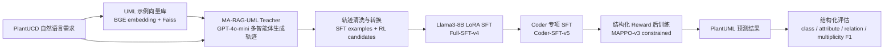

# ReMA-RAG 项目 PPT 技术路线与实验结果说明

这份文档用于帮助制作答辩 PPT 的同学快速理解项目细节。重点不是堆代码，而是讲清楚：我们为什么做这个项目、具体怎么融合 MA-RAG 与 MMOA-RAG/MAPPO、每个实验指标代表什么、哪些图适合放入 PPT、最终成果应该如何客观表述。

## 1. 项目一句话概括

本项目研究的是：如何把“自然语言需求描述”自动转换为更准确的 PlantUML 类图代码。

我们的核心方法是 ReMA-RAG：先用 MA-RAG 的多智能体 RAG 推理流程生成高质量 UML 轨迹数据，再借鉴 MMOA-RAG 的 SFT + 强化学习后训练思路，对 Llama3-8B-Instruct 进行 LoRA 微调和结构化 reward 优化，使模型更擅长生成类、属性、方法、关系、关系标签和多重性等 UML 结构。

答辩时可以这样说：

> 本项目面向 PlantUML 类图生成任务，将多智能体检索增强生成与强化学习后训练结合起来。我们首先构建 GPT-4o-mini teacher 轨迹数据，再对 Llama3-8B-Instruct 进行 LoRA SFT，并进一步使用基于 UML 结构匹配的 reward 进行 MAPPO/PPO 风格后训练。实验表明，SFT 是主要性能来源，强化学习后训练在属性、关系标签和多重性等细粒度结构指标上带来进一步小幅提升。

## 2. 两篇参考工作的作用

### 2.1 MA-RAG 的作用

参考论文：

- MA-RAG: Multi-Agent Retrieval-Augmented Generation via Collaborative Chain-of-Thought Reasoning
- 论文链接：https://arxiv.org/abs/2505.20096
- 代码链接：https://github.com/thangylvp/MA-RAG

MA-RAG 原本是多智能体 RAG 问答框架。它的核心价值不是某一个具体数据集，而是“多个 agent 协同完成复杂推理”的流程。

在我们的项目中，MA-RAG 主要提供多智能体生成框架：

| Agent | 在原框架中的作用 | 在本项目 UML 任务中的作用 |
|---|---|---|
| Planner | 拆解问题，制定推理步骤 | 分析需求描述，规划需要生成哪些 UML 元素 |
| Step Definer | 明确每一步需要做什么 | 判断需要抽取类、属性、方法、关系、多重性等结构 |
| Extractor | 从检索材料中提取信息 | 从相似 UML 示例和需求中抽取可复用结构 |
| Coder | 生成最终答案 | 生成最终 PlantUML 类图代码 |

我们不是直接照搬 MA-RAG 的问答任务，而是把它迁移到了 PlantUML 类图生成任务。

### 2.2 MMOA-RAG / MAPPO 的作用

参考论文：

- Improving Retrieval-Augmented Generation through Multi-Agent Reinforcement Learning
- 论文链接：https://arxiv.org/abs/2501.15228
- 代码链接：https://github.com/chenyiqun/MMOA-RAG

MMOA-RAG 的核心价值是多智能体 RAG 的训练范式：先监督微调，让 agent 学会基本行为；再用强化学习优化多智能体协作质量。

在我们的项目中，借鉴的是这个训练思路：

1. 使用 teacher 生成轨迹数据。
2. 使用 SFT 让 student model 学会 PlantUML 生成格式和基本行为。
3. 使用结构化 reward 对生成结果进行后训练优化。

需要注意的严谨表述：

> 当前项目不是完整复刻 MMOA-RAG 在 HotpotQA 上的全部训练流程，而是将其“SFT 热身 + 强化学习后训练”的思想迁移到 PlantUML 类图生成任务中。当前 MAPPO-v3 主要验证了结构化 reward 后训练的可行性，尚未完成 Planner、Step Definer、Extractor、Coder 四个 agent 全部独立 actor 的完整多智能体强化学习。

这句话很重要，答辩时可以避免被老师追问“你们是否真的完整实现了 MAPPO”。

## 3. 整体技术路线

PPT 中建议画一张总流程图，结构如下：



### 3.1 数据来源与数据构造

我们使用 PlantUCD / PlantUML 类图相关数据。每条样本包含：

- 自然语言需求描述，记作 HumanLang；
- 参考 PlantUML 类图代码，作为 gold；
- 用于检索的 UML 示例库。

为了构造训练数据，我们使用 GPT-4o-mini 作为 teacher，在 MA-RAG-UML 多智能体流程中生成 PlantUML 代码，并记录中间推理过程和最终结果。

数据流如下：

1. 输入自然语言需求。
2. 使用 BGE 模型将需求向量化。
3. 在 Faiss 向量库中检索相似 UML 示例。
4. MA-RAG 的 Planner、Step Definer、Extractor、Coder 依次协作。
5. 生成最终 PlantUML。
6. 使用规则评估器比较预测 PlantUML 与 gold PlantUML。
7. 按 reward 分桶，得到 SFT 正样本、RL 候选样本和 hard case。

我们前期生成了 1127 条训练/候选轨迹数据，分桶结果大致为：

| 数据桶 | 数量 | 用途 |
|---|---:|---|
| SFT positive | 504 | 质量较高，适合作为监督微调数据 |
| RL candidate | 298 | 中等质量，适合强化学习后训练 |
| hard case | 325 | 低质量/困难样本，主要用于误差分析或后续改进 |

说明：这些数据不是最终测试集，而是用于构造训练和后训练数据。

### 3.2 SFT 阶段

SFT 目标：让 Llama3-8B-Instruct 学会 PlantUML 任务格式和基础结构生成能力。

我们训练了多个版本：

| 版本 | 目的 |
|---|---|
| Full-SFT-v4 | 使用全量 SFT 样本训练，建立主要 student baseline |
| Coder-SFT-v5 | 针对 Coder / final PlantUML 输出继续优化，强化属性、关系标签、多重性 |
| Coder-SFT-v6 | 尝试结构保持约束，但实验结果下降，作为负向消融 |

从结果看，SFT 是性能提升的主要来源。Llama3 zero-shot 的 total 只有 0.374，而 Full-SFT-v4 提升到 0.607。

### 3.3 强化学习后训练阶段

强化学习目标：在 SFT 已经掌握格式的基础上，进一步优化 UML 结构细节。

我们使用基于规则的结构化 reward，而不是 LLM-as-a-Judge。原因：

1. 当前任务有 gold PlantUML，可以用结构解析计算更稳定的指标；
2. LLM-as-a-Judge 成本高、波动大；
3. 答辩阶段需要可复现、可解释的评价方式。

当前 MAPPO-v3 constrained 的核心思路：

- 从 Coder-SFT-v5 初始化；
- 对生成 PlantUML 进行结构解析；
- 根据 class、attribute、method、relation、label、multiplicity 等指标计算 reward；
- 对比 Full-SFT 或 Coder-SFT 的基础表现，避免盲目优化某个指标导致整体退化；
- 使用 tiny64 / tiny128 做可行性验证。

重要结论：

- MAPPO-v3 tiny64 是当前 student model 中的最佳结果；补充的 GPT-4o-mini MA-RAG-UML teacher baseline 为 0.631，可作为 teacher 上界参考；
- MAPPO-v3 tiny128 没有继续提升，说明不是训练数据越多越好；
- RL 的提升是小幅的，不能夸大。

## 4. 评价指标解释

主表中的每个数值都是在 142 条测试集上逐样本计算后取平均。

### 4.1 Total

Total 是综合结构分数，越高越好。

它不是简单准确率，而是对多个 UML 结构指标进行综合后的 reward。它反映模型生成的 PlantUML 与 gold PlantUML 在整体结构上的接近程度。

答辩解释：

> Total 可以理解为综合 UML 结构相似度，包含格式、语法、类、属性、方法、关系、关系标签、多重性等因素。

### 4.2 Class F1

Class F1 衡量生成代码中的类名集合是否和 gold 匹配。

例子：

```plantuml
class User
class Booking
class Payment
```

如果 gold 中有 `User, Booking, Payment`，预测也生成了这些类，则 class_f1 较高。

为什么重要：

- 类是类图中最核心的实体；
- 如果类识别错了，后面的属性和关系也容易错。

### 4.3 Attribute F1

Attribute F1 衡量类中的属性是否匹配。

例子：

```plantuml
class User {
  +userId: String
  +email: String
}
```

它关注：

- 属性名是否正确；
- 属性属于哪个类；
- 属性类型是否匹配；
- 格式是否规范。

我们之前发现过一个典型问题：模型会生成 `+String userId`，而 gold 习惯是 `+userId: String`。所以后来加入了 normalized 评价，减少纯格式差异造成的误判。

### 4.4 Method F1

Method F1 衡量方法是否匹配。

例子：

```plantuml
class Booking {
  +confirmBooking(): void
  +cancelBooking(): void
}
```

它关注模型是否能从需求中抽取行为/操作。

### 4.5 Relation Pair F1

Relation Pair F1 衡量类与类之间是否连对了。

例子：

```plantuml
User --> Booking
Booking --> Payment
```

即使关系标签不完全一致，只要连接的两个类对了，relation_pair_f1 就会提高。

为什么重要：

- 它反映类图结构骨架；
- 比 relation_label 更基础。

### 4.6 Relation Label F1

Relation Label F1 衡量关系语义标签是否匹配。

例子：

```plantuml
User --> Booking : creates
Booking --> Payment : pays
```

如果类对连对了，但标签从 `creates` 变成 `has`，relation_pair 可能仍然高，但 relation_label 会低。

当前项目中，relation_label 是一个比较难的指标。MAPPO-v3 对它有明显改进。

### 4.7 Multiplicity F1

Multiplicity F1 衡量多重性是否匹配。

例子：

```plantuml
User "1" --> "0..*" Booking
```

它关注：

- 一对一；
- 一对多；
- 零到多；
- 可选关系等。

这个指标很细粒度，GPT direct 和 zero-shot 常常不稳定。MAPPO-v3 对它有小幅提升。

### 4.8 Strict Mean 与 Normalized Mean

有些 summary 文件中有两套指标：

| 指标 | 含义 |
|---|---|
| strict_mean | 严格按照原始 PlantUML 字面结构比较 |
| normalized_mean | 对部分等价格式做归一化后比较 |

例如：

```plantuml
+String userId
```

和：

```plantuml
+userId: String
```

语义上接近，但格式不同。normalized_mean 会尽量减少这种纯格式差异带来的影响。

PPT 主表建议使用 normalized_mean，因为它更接近 UML 结构语义评价。

## 5. 当前主实验结果怎么解释

当前最适合放 PPT 的主表如下：

| 方法 | Total | Class | Attr | Method | RelPair | RelLabel | Mult |
|---|---:|---:|---:|---:|---:|---:|---:|
| Llama3 zero-shot | 0.374 | 0.813 | 0.425 | 0.587 | 0.121 | 0.176 | 0.433 |
| GPT-4o-mini direct | 0.540 | 0.816 | 0.618 | 0.651 | 0.543 | 0.172 | 0.432 |
| GPT-4o-mini MA-RAG-UML teacher | **0.631** | **0.861** | 0.600 | **0.710** | **0.675** | **0.373** | **0.469** |
| Full-SFT-v4 | 0.607 | 0.838 | 0.714 | 0.682 | 0.603 | 0.262 | 0.432 |
| Coder-SFT-v5 | 0.614 | 0.810 | 0.769 | 0.677 | 0.583 | 0.321 | 0.456 |
| MAPPO-v3 tiny64 | **0.618** | 0.812 | **0.776** | 0.677 | 0.586 | **0.328** | **0.463** |
| MAPPO-v3 tiny128 | 0.613 | 0.811 | 0.763 | 0.677 | 0.583 | 0.317 | 0.456 |

### 5.1 各方法含义

#### Llama3 zero-shot

未经过本项目数据训练的 Llama3-8B-Instruct，直接根据需求生成 PlantUML。

作用：

- 作为最基础的开源模型 baseline；
- 说明原始 Llama3 虽然能识别部分 class，但关系结构生成很差。

观察：

- class_f1 = 0.813，不算低；
- relation_pair_f1 = 0.121，非常低；
- total = 0.374。

说明：模型知道大概有哪些实体，但不会稳定构建 UML 关系。

#### GPT-4o-mini direct

直接用 GPT-4o-mini 根据需求生成 PlantUML，不使用 MA-RAG 多智能体流程，也不训练。

作用：

- 作为强 prompt baseline；
- 对比“直接调用闭源模型”和“训练后的开源模型”。

观察：

- total = 0.540；
- relation_pair_f1 从 0.121 提升到 0.543；
- 说明 GPT-4o-mini 本身更擅长结构生成；
- 但仍低于训练后的 Llama3。

#### GPT-4o-mini MA-RAG-UML teacher

使用 GPT-4o-mini 作为闭源 teacher，并接入 MA-RAG-UML 多智能体检索增强流程，输出最终 PlantUML。

作用：

- 作为 teacher / upper-bound baseline；
- 用于衡量 student model 经过 SFT 和 MAPPO 后距离 teacher 还有多大差距；
- 说明 MA-RAG 流程相对 direct prompt 是否带来增益。

观察：

- total = 0.631，是当前整体最高；
- class_f1 = 0.861、relation_pair_f1 = 0.675、relation_label_f1 = 0.373，均明显高于 GPT-4o-mini direct；
- attribute_f1 = 0.600，低于 Coder-SFT-v5 和 MAPPO-v3，说明 teacher 在属性细节格式/覆盖上并非全优。

答辩解释：

> GPT-4o-mini MA-RAG-UML teacher 的整体分数最高，说明多智能体 RAG 流程本身对 UML 结构生成有效；我们的 student model 通过 SFT 和 MAPPO 已经接近 teacher 的整体水平，并在 attribute_f1 上超过 teacher，但在 class、relation pair、relation label 等全局结构指标上仍有差距。

#### Full-SFT-v4

使用 teacher trajectory 构造的全量 SFT 数据对 Llama3-8B 进行 LoRA 微调。

作用：

- 证明训练数据有效；
- 是本项目的主要 student baseline。

观察：

- total 从 Llama3 zero-shot 的 0.374 提升到 0.607；
- 相比 GPT-4o-mini direct 的 0.540 也明显更高。

答辩重点：

> 这说明通过任务数据 SFT 后，小模型可以在结构化 UML 指标上超过直接调用 GPT-4o-mini。

#### Coder-SFT-v5

在 Full-SFT 基础上，进一步强化 Coder/final PlantUML 输出。

作用：

- 针对生成最终代码的 agent 做专项优化；
- 改善属性、关系标签、多重性等细节。

观察：

- total = 0.614，高于 Full-SFT-v4；
- attribute_f1 从 0.714 到 0.769；
- relation_label_f1 从 0.262 到 0.321；
- multiplicity_f1 从 0.432 到 0.456；
- 但 class_f1 和 relation_pair_f1 有下降。

解释：

> Coder-SFT-v5 更关注代码细节，所以属性和关系标签变好，但对全局类/关系骨架有轻微牺牲。

#### MAPPO-v3 tiny64

在 Coder-SFT-v5 基础上进行结构化 reward 后训练。

作用：

- 验证强化学习后训练能否进一步优化 UML 细粒度结构；
- 是当前 student model 中的最佳版本。

观察：

- total = 0.618，为当前 student model 最高，但低于 GPT-4o-mini MA-RAG-UML teacher 的 0.631；
- attribute_f1 = 0.776，最高；
- relation_label_f1 = 0.328，最高；
- multiplicity_f1 = 0.463，最高；
- 相比 Coder-SFT-v5 的提升较小，但方向是正的。

严谨表述：

> MAPPO-v3 在 SFT 基础上带来了小幅但稳定的正向改进，主要体现在属性、关系标签和多重性等细粒度结构上。

不要说：

> 强化学习显著大幅提升性能。

这个说法不严谨。

#### MAPPO-v3 tiny128

训练样本扩大到 tiny128 的 MAPPO 版本。

作用：

- 作为消融实验；
- 说明更多 RL 样本不一定更好。

观察：

- total = 0.613，低于 tiny64；
- 说明当前 reward 和采样策略还需要改进。

答辩可以这样讲：

> tiny128 没有超过 tiny64，说明当前 RL 后训练对样本选择和 reward 稳定性比较敏感，后续需要更细粒度的 agent-level reward 和更稳定的训练策略。

## 6. 可以强调的提升幅度

PPT 中可以单独做一页“关键提升”。

| 对比 | Total 提升 | 含义 |
|---|---:|---|
| Llama3 zero-shot -> Full-SFT-v4 | +0.232 | SFT 数据和任务微调带来主要提升 |
| GPT-4o-mini direct -> MAPPO-v3 tiny64 | +0.078 | 训练后的 Llama3 在该结构指标上超过 direct GPT-4o-mini |
| GPT-4o-mini direct -> GPT-4o-mini MA-RAG-UML teacher | +0.090 | 多智能体 RAG 流程相对直接 prompt 带来明显提升 |
| Full-SFT-v4 -> Coder-SFT-v5 | +0.007 | Coder 专项 SFT 带来进一步提升 |
| Coder-SFT-v5 -> MAPPO-v3 tiny64 | +0.004 | RL 后训练带来小幅正向改进 |
| Full-SFT-v4 -> MAPPO-v3 tiny64 | +0.011 | 从普通 SFT 到最终方法的整体增益 |

建议 PPT 上用柱状图展示 Total：

```text
Llama3 zero-shot      0.374
GPT-4o-mini direct    0.540
GPT-4o-mini MA-RAG    0.631
Full-SFT-v4           0.607
Coder-SFT-v5          0.614
MAPPO-v3 tiny64       0.618
MAPPO-v3 tiny128      0.613
```

图标题建议：

> 不同训练阶段在 PlantUML 测试集上的综合结构分数

## 7. 训练图应该放哪些

### 7.1 Full-SFT-v4 training_loss.png

用途：

- 证明全量 SFT 训练正常收敛；
- 说明模型确实学习到了 teacher trajectory 的输出分布。

PPT 说明：

> Full-SFT 阶段训练损失整体下降，说明模型逐步学习 PlantUML 生成格式和多智能体轨迹中的任务行为。

### 7.2 Full-SFT-v4 training_eval_loss.png

用途：

- 证明验证集 loss 没有明显崩坏；
- 支撑模型不是只记忆训练集。

PPT 说明：

> 验证损失保持在较低水平，说明 SFT 后模型在 held-out 样本上仍能较稳定生成结构化代码。

### 7.3 Coder-SFT-v5 training_loss.png

用途：

- 展示 Coder 专项训练过程；
- 对应表格中 attribute、relation_label、multiplicity 的提升。

PPT 说明：

> Coder-SFT-v5 对最终 PlantUML 代码生成进行专项优化，使模型在属性、关系标签和多重性等细粒度结构上进一步提升。

### 7.4 MAPPO-v3 training_reward.png

这是最应该放的 RL 图。

用途：

- 证明 RL 阶段确实在根据 reward 进行训练；
- 展示 reward 有反馈、有波动。

PPT 说明：

> MAPPO-v3 阶段使用结构化 UML reward 进行后训练，reward 曲线反映了模型在不同样本上的结构匹配反馈。由于当前是 tiny-scale 验证，曲线仍存在波动，但最终在测试集上取得小幅正向改进。

### 7.5 MAPPO-v3 training_loss.png

用途：

- 作为 RL 优化过程辅助图；
- 可以和 reward 图放在同一页。

PPT 说明：

> PPO/MAPPO 后训练中的 loss 反映策略更新过程，reward 和 loss 共同说明后训练流程已经跑通。

## 8. 图文件怎么找

云端可以用这个命令列出所有训练图：

```bash
find /hy-tmp -path "*rema_plantuml*" \( \
  -name "training_loss.png" -o \
  -name "training_eval_loss.png" -o \
  -name "training_reward.png" \
\) -print
```

建议下载以下几类：

```text
Full-SFT-v4/training_loss.png
Full-SFT-v4/training_eval_loss.png
Coder-SFT-v5/training_loss.png
Coder-SFT-v5/training_eval_loss.png
MAPPO-v3 constrained tiny64/training_reward.png
MAPPO-v3 constrained tiny64/training_loss.png
```

如果文件名路径太乱，可以直接打包：

```bash
mkdir -p /hy-tmp/rema_ppt_assets

find /hy-tmp -path "*rema_plantuml*" \( \
  -name "training_loss.png" -o \
  -name "training_eval_loss.png" -o \
  -name "training_reward.png" \
\) -print | tee /hy-tmp/rema_plot_paths.txt

tar -czf /hy-tmp/rema_ppt_assets_$(date +%Y%m%d_%H%M%S).tar.gz \
  -T /hy-tmp/rema_plot_paths.txt \
  /hy-tmp/rema_final_baseline_comparison.json 2>/dev/null
```

本地下载：

```powershell
scp -P 37490 root@i-2.gpushare.com:/hy-tmp/rema_ppt_assets_*.tar.gz D:\Temp\
```

## 9. qualitative case analysis 怎么做

案例分析不是看 summary，而是看每条样本的 eval jsonl 和 pairwise csv。

建议选 3 类样本：

### 9.1 MAPPO-v3 明显变好的样本

选择标准：

```text
MAPPO-v3 total - Full-SFT-v4 total 最大
```

PPT 展示重点：

- Full-SFT 漏了哪些属性/关系标签/多重性；
- MAPPO-v3 补上了什么；
- reward 对哪些结构指标起作用。

### 9.2 MAPPO-v3 变差的样本

选择标准：

```text
MAPPO-v3 total - Full-SFT-v4 total 最小
```

PPT 展示重点：

- 诚实说明 RL 后训练仍有副作用；
- 例如可能提升了属性，但牺牲了 class 或 relation pair；
- 引出后续工作：更细粒度 agent-level reward。

### 9.3 逐步改善的样本

选择标准：

```text
Llama3 zero-shot < GPT-4o-mini direct < Full-SFT-v4 <= MAPPO-v3
```

或者：

```text
Llama3 zero-shot < Full-SFT-v4 < MAPPO-v3
```

PPT 展示重点：

- 这是最适合讲完整技术路线的 case；
- 可以展示从原始 Llama 到 SFT，再到 RL 后训练，每一步具体修正了什么。

## 10. PPT 推荐结构

建议 12 页左右，不要太长。

### 第 1 页：标题页

标题建议：

> 基于多智能体 RAG 与结构化强化学习的 PlantUML 类图生成方法

或者课程设计风格：

> ReMA-RAG：一种结合多智能体检索增强与强化学习后训练的 PlantUML 类图生成方法

### 第 2 页：任务背景

要讲清楚：

- 软件需求分析中，类图从自然语言需求中提取；
- 手工建模耗时，且容易漏掉类、属性、关系；
- LLM 可以生成 PlantUML，但直接生成容易出现结构不完整。

建议放一个小例子：

```text
需求：用户可以创建订单，订单包含多个商品，并通过支付完成交易。
输出：PlantUML 类图代码。
```

### 第 3 页：问题挑战

列 3 个挑战：

1. 类、属性、方法、关系需要同时正确；
2. 关系标签和多重性难从自然语言中稳定抽取；
3. 直接 prompt 容易格式正确但结构不完整。

可以放之前的错误案例：

- 关系连错；
- 属性类型格式错；
- 多重性缺失；
- 多生成或漏生成类。

### 第 4 页：方法总览

放整体流程图。

核心关键词：

- PlantUCD 数据；
- BGE + Faiss 检索；
- MA-RAG-UML teacher；
- SFT；
- MAPPO/PPO 风格结构化后训练；
- UML rule reward。

### 第 5 页：MA-RAG-UML 多智能体生成

展示四个 agent：

| Agent | 作用 |
|---|---|
| Planner | 分析需求，规划 UML 元素 |
| Step Definer | 明确抽取类/属性/方法/关系的步骤 |
| Extractor | 结合 RAG 示例抽取结构信息 |
| Coder | 生成最终 PlantUML |

说明：

> 我们用 GPT-4o-mini 作为 teacher，记录多智能体生成轨迹，用于后续训练 student model。

### 第 6 页：训练数据构建

放数据流：

```text
需求 + gold PlantUML
-> GPT-4o-mini MA-RAG-UML 生成轨迹
-> rule reward 评估
-> SFT positive / RL candidate / hard case
-> 3056 条 SFT examples
```

可以放数据桶表：

| 数据桶 | 数量 | 用途 |
|---|---:|---|
| SFT positive | 504 | 监督微调 |
| RL candidate | 298 | 后训练候选 |
| hard case | 325 | 误差分析 |

### 第 7 页：结构化 Reward 与评价指标

放指标表：

| 指标 | 评价内容 |
|---|---|
| class_f1 | 类名是否匹配 |
| attribute_f1 | 属性名、类型、所属类是否匹配 |
| method_f1 | 方法是否匹配 |
| relation_pair_f1 | 类之间是否连对 |
| relation_label_f1 | 关系语义标签是否正确 |
| multiplicity_f1 | 多重性是否正确 |
| total | 综合结构分数 |

说明：

> 相比只看 exact match，结构化 reward 更适合 UML 类图生成，因为等价图可能在代码文本上并不完全一致。

### 第 8 页：主实验结果

放主表。

突出：

- GPT-4o-mini MA-RAG-UML teacher total 最高，可作为 teacher 上界；
- MAPPO-v3 tiny64 是 student model 中 total 最高；
- SFT 带来主要提升；
- MAPPO 带来小幅细粒度提升。

建议同时放一个 Total 柱状图。

### 第 9 页：训练过程曲线

放 3 张图即可：

1. Full-SFT-v4 training loss；
2. Coder-SFT-v5 training/eval loss；
3. MAPPO-v3 reward curve。

说明：

> SFT 阶段 loss 下降，说明模型学会了 PlantUML 生成分布；MAPPO 阶段 reward 曲线表明结构化反馈已接入训练。

### 第 10 页：案例分析

放一个“逐步改善”样本。

推荐版式：

| Gold | Llama3 zero-shot | Full-SFT-v4 | MAPPO-v3 |
|---|---|---|---|
| 正确代码/图 | 漏关系 | 补部分类和属性 | 补关系标签/多重性 |

旁边用红色标错，绿色标改进。

### 第 11 页：消融与局限

可以讲：

- Coder-SFT-v5 提升属性和关系标签，但牺牲部分 class/relation pair；
- MAPPO-v3 tiny128 不如 tiny64，说明 RL 样本扩大后不一定稳定；
- 当前 RL 增益较小，还需要更细粒度 reward；
- GPT-4o-mini MA-RAG-UML teacher baseline 还在补充。

这页很重要，显得你们不是只会报喜。

### 第 12 页：总结与后续工作

总结三点：

1. 构建了面向 PlantUML 的多智能体 RAG 生成流程；
2. 完成了 teacher trajectory -> LoRA SFT -> MAPPO/PPO 后训练的完整实验链路；
3. 在 142 条测试集上，GPT-4o-mini MA-RAG-UML teacher 达到 total 0.631，最终 student model MAPPO-v3 tiny64 达到 total 0.618。

后续工作：

- 完成 GPT-4o-mini MA-RAG-UML teacher baseline；
- 设计 agent-level reward；
- 引入更稳定的 preference optimization / DPO / GRPO；
- 扩大测试集；
- 做人工专家评价。

## 11. 答辩时的推荐说法

可以说：

> 本项目中，SFT 是 student model 的主要性能提升来源。经过 teacher trajectory 构造和 LoRA 微调后，Llama3-8B 从 zero-shot 的 0.374 提升到 Full-SFT 的 0.607，并超过 GPT-4o-mini direct 的 0.540。进一步的 Coder-SFT 和 MAPPO-v3 主要改善属性、关系标签、多重性等细粒度 UML 结构，最终 student total 达到 0.618。补充实验中，GPT-4o-mini MA-RAG-UML teacher 达到 0.631，说明多智能体 RAG teacher 流程仍是当前上界。

可以说：

> MAPPO-v3 的提升幅度不大，但方向是正的，说明结构化 reward 后训练在 PlantUML 类图生成任务上具有可行性。

不要说：

> 强化学习显著大幅提升了模型性能。

不要说：

> 我们已经完整实现了 MMOA-RAG 的全部多智能体 MAPPO。

更严谨的说法：

> 当前实现是 MMOA-RAG 思路在 PlantUML 任务上的迁移与简化验证，完成了 SFT 和 MAPPO/PPO 风格结构化后训练闭环，后续仍需扩展到更完整的 agent-level 多智能体强化学习。

## 12. 当前项目成果的客观评价

从课程设计和创新实验角度看，这个项目完成度较高，因为它不是简单 prompt engineering，而是包含：

- 数据集构建；
- 向量检索库；
- 多智能体 RAG 流程；
- teacher trajectory 生成；
- LoRA SFT；
- 结构化 reward；
- MAPPO/PPO 后训练；
- 自动化结构评估；
- baseline 对比；
- case analysis。

从论文角度看，目前还属于初步实验结果，亮点是有完整 pipeline 和可解释结构指标，但还需要补强：

- teacher MA-RAG baseline；
- 更大规模测试集；
- 更稳定 RL 训练；
- 更严格消融；
- 人工评价；
- agent-level reward。

一句话客观结论：

> 当前结果已经足够支撑课程答辩和创新实验中期/结项展示；如果要投稿论文，还需要进一步补充强 baseline、扩大测试集，并证明强化学习部分带来的提升具有稳定性和统计意义。
