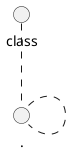

# ReMA-RAG 算法融合与源项目差异详解

本文档专门说明本项目在**算法细节**上如何融合 MA-RAG 与 MMOA-RAG，以及与两个源项目相比到底改了什么。重点不是笼统地说“任务从问答变成 UML 生成”，而是展开到 agent 设计、数据结构、trajectory 构造、SFT 样本、reward、训练目标、后训练流程和评价器等具体算法层面。

---

## 1. 本项目不是两个源项目的简单拼接

本项目的核心融合可以概括为：

```text
MA-RAG 的多智能体 RAG 推理框架
+ MMOA-RAG 的 SFT + MAPPO/PPO 风格训练范式
+ PlantUML/UML 结构化任务定义
= ReMA-RAG
```

但这不是把 MA-RAG 和 MMOA-RAG 的代码直接合并。两个源项目原本都面向问答任务，而本项目面向 PlantUML 类图生成，因此我们在算法层面做了以下重新定义：

1. 重新定义 agent 的语义；
2. 重新定义 agent 的输入输出格式；
3. 重新定义检索库；
4. 重新定义 teacher trajectory；
5. 重新定义 SFT 训练样本；
6. 重新定义 reward；
7. 重新定义评估指标；
8. 重新定义 MAPPO/PPO 风格后训练目标；
9. 重新设计 Coder 智能体单侧训练；
10. 尝试 agent-aware credit assignment 的初步版本。

---

## 2. 与 MA-RAG 的算法差异

### 2.1 MA-RAG 原算法流程

MA-RAG 原项目的核心流程可以抽象为：

```text
Question
-> Planner 拆解问题
-> Step Definer 定义推理步骤
-> Retriever 检索文档
-> Extractor 抽取证据
-> Coder / Executor 生成答案
-> Answer
```

它的目标是回答自然语言问题。因此，MA-RAG 中 agent 的中间输出主要是围绕“推理链”和“答案证据”设计的。

### 2.2 本项目对 MA-RAG agent 的重新定义

我们没有直接沿用 MA-RAG 的问答语义，而是把 agent 重新定义为 UML 类图生成流程中的不同阶段。

| Agent | MA-RAG 原含义 | ReMA-RAG 中的新含义 | 算法输出重点 |
|---|---|---|---|
| Planner | 分解自然语言问题 | 分析需求中有哪些核心领域对象 | 候选类、模块边界、核心实体 |
| Step Definer | 规划回答问题的推理步骤 | 规划 UML 建模步骤 | 应抽取类、属性、方法、关系、多重性 |
| Extractor | 从检索文档中抽取问答证据 | 从需求和相似 UML 示例中抽取结构元素 | 类名、属性、方法、关系候选 |
| Coder | 整合证据生成自然语言答案 | 将结构元素转成 PlantUML 代码 | 最终 PlantUML 类图 |

这个变化不是只改 prompt，而是改变了 agent 的“动作空间”。在问答任务中，agent 输出的是解释性文本或答案片段；在本项目中，agent 输出必须服务于后续结构化代码生成。

### 2.3 输入数据结构的变化

MA-RAG 原始输入通常是：

```json
{
  "question": "...",
  "retrieved_docs": ["doc1", "doc2", "..."]
}
```

本项目输入改为：

```json
{
  "id": "plantucd_test_0",
  "requirement": "natural language software requirement",
  "retrieved_uml_examples": [
    {
      "requirement": "similar requirement",
      "plantuml": "@startuml ..."
    }
  ],
  "gold_plantuml": "@startuml ..."
}
```

这个差异很重要：我们的检索结果不是普通知识文档，而是**带有代码结构的 UML 示例**。因此后续 agent 需要从示例中学习结构模式，而不是从文档中抽取事实句。

### 2.4 检索模块的变化

MA-RAG 原始检索面向开放域文本，例如 Wikipedia 或问答语料。

本项目检索对象变为 UML 示例库：

```text
需求文本 / UML 示例文本
-> BGE embedding
-> Faiss 向量索引
-> top-k 相似 UML 示例
```

算法变化在于：

| 维度 | MA-RAG | ReMA-RAG |
|---|---|---|
| 检索对象 | 文档段落 | UML 示例 |
| 检索目的 | 找答案证据 | 找结构相似的类图模式 |
| 检索后使用方式 | 支撑自然语言推理 | 支撑类、属性、关系生成 |
| 检索错误影响 | 答案事实错误 | UML 结构迁移错误 |

因此，ReMA-RAG 的 RAG 不是“查知识”，而是“查相似建模模式”。

### 2.5 Coder 输出空间的变化

MA-RAG 的 Coder / Executor 输出通常是自然语言答案：

```text
The answer is ...
```

ReMA-RAG 的 Coder 输出必须是：



这导致算法约束完全不同：

1. 必须保证 `@startuml` 和 `@enduml`；
2. 类定义必须语法合法；
3. 属性和方法要在类块中；
4. 关系必须连接已定义类；
5. 多重性和标签要尽量符合 gold；
6. 不能输出多余解释文本。

因此我们后续才专门做了 Coder-SFT-v5，因为最终 PlantUML 的语法和结构主要由 Coder 决定。

---

## 3. 与 MMOA-RAG 的算法差异

### 3.1 MMOA-RAG 原算法流程

MMOA-RAG 原项目的多智能体结构可以抽象为：

```text
Question
-> Query Rewrite agent
-> Document Selector agent
-> Answer Generator agent
-> Reward
-> MAPPO / PPO update
```

其 reward 主要围绕问答任务设计，例如答案是否正确、是否匹配 gold answer。

### 3.2 ReMA-RAG 中 agent 不是 Query Rewrite / Selector / Generator

我们没有直接使用 MMOA-RAG 的三个 agent，因为 UML 生成任务不适合 Query Rewrite / Document Selector / Answer Generator 这种划分。

本项目的 agent 划分来自 MA-RAG-UML：

```text
Planner
Step Definer
Extractor
Coder
```

因此，ReMA-RAG 与 MMOA-RAG 的 agent 对应关系不是一一复制，而是训练范式上的借鉴：

| MMOA-RAG | ReMA-RAG |
|---|---|
| Query Rewrite | 不直接保留，由 Planner / Step Definer 承担需求分析 |
| Document Selector | 检索阶段保留，但检索对象变为 UML 示例 |
| Answer Generator | 由 Coder 替代，输出 PlantUML |
| QA reward | 替换为 UML 结构 reward |
| MAPPO 训练思想 | 迁移为 PlantUML 结构 reward 后训练 |

### 3.3 Reward 从答案正确性变成结构相似度

MMOA-RAG 的 reward 面向问答，核心关注：

```text
生成答案是否等于 gold answer
```

本项目不能这样做，因为 PlantUML 代码有多种等价写法。我们必须解析结构后打分。

ReMA-RAG 的 reward 可以写成：

```text
R = w_format * format_score
  + w_syntax * syntax_score
  + w_class * class_f1
  + w_attr * attribute_f1
  + w_method * method_f1
  + w_rel_pair * relation_pair_f1
  + w_rel_label * relation_label_f1
  + w_mult * multiplicity_f1
```

这和 MMOA-RAG 的 QA reward 有本质区别：

| 维度 | MMOA-RAG reward | ReMA-RAG reward |
|---|---|---|
| 评价对象 | 自然语言答案 | PlantUML 结构 |
| 是否可字符串匹配 | 相对可以 | 基本不适合 |
| reward 粒度 | 答案级 | 类、属性、方法、关系、多重性 |
| reward 噪声来源 | 答案别名、检索错误 | UML 等价表达、解析误差、结构歧义 |

### 3.4 MAPPO 训练目标的变化

MMOA-RAG 中 MAPPO 优化的是：

```text
多 agent 协作后能否得到正确答案
```

ReMA-RAG 中后训练优化的是：

```text
模型生成的 PlantUML 是否在结构上更接近 gold UML
```

因此，后训练的优化目标从“答案正确性”变成“结构相似度”。

### 3.5 当前不是完整多 actor MAPPO

这是必须严谨说明的算法边界。

完整多 agent MAPPO 理想状态下应该是：

```text
Planner actor
Step Definer actor
Extractor actor
Coder actor
centralized critic
agent-level reward / shared reward
```

而本项目当前 MAPPO-v3 constrained 更接近：

```text
以 Coder-SFT-v5 为初始化模型
-> 对最终 PlantUML 输出采样
-> 用 UML rule reward 计算反馈
-> 用 PPO/MAPPO 风格流程更新 LoRA 和 value head
```

因此，当前实现是：

```text
MAPPO/PPO-style structural reward post-training
```

而不是严格意义上的完整多 actor MAPPO。

我们额外做了 agent-aware SFT v0 来探索中间 agent 监督，但结果不如 Coder-SFT-v5，说明简单把中间 agent 监督加入训练并不能替代真正的 credit assignment。

---

## 4. 融合点一：Teacher trajectory 的重新构造

### 4.1 源项目中的 trajectory

MA-RAG 的 trajectory 更像问答推理过程：

```text
question
planning
retrieval
extraction
answer
```

MMOA-RAG 的训练数据更关注多 agent 对问答的协作，例如 query rewrite、document selection、answer generation。

### 4.2 ReMA-RAG 中的 trajectory

本项目构造的 trajectory 包含 UML 任务专属字段：

```json
{
  "id": "plantucd_test_x",
  "requirement": "...",
  "retrieved_examples": [...],
  "planner_output": "...",
  "step_definer_output": "...",
  "extractor_output": "...",
  "coder_output": "@startuml ... @enduml",
  "gold_plantuml": "@startuml ... @enduml",
  "rule_reward": {
    "total": 0.61,
    "class_f1": 0.83,
    "attribute_f1": 0.72,
    "relation_pair_f1": 0.60,
    "relation_label_f1": 0.26,
    "multiplicity_f1": 0.43
  }
}
```

这个 trajectory 的算法价值是：

1. 可以作为 teacher 监督数据；
2. 可以计算 reward；
3. 可以分析错误来源；
4. 可以拆出 Coder 训练样本；
5. 可以尝试 agent-aware 训练。

### 4.3 为什么使用 GPT-4o-mini 作为 teacher

本项目没有直接让 Llama3-8B-Instruct 从零生成训练数据，而是使用 GPT-4o-mini teacher。原因是：

1. teacher 输出质量更高；
2. teacher 更适合生成多步 agent trajectory；
3. Llama3-8B-Instruct 作为 student 更适合通过 SFT 学习；
4. 训练开源 student 比直接调用闭源 teacher 更可控；
5. 后续可以在 student 上做 LoRA 和 reward 后训练。

这属于典型 teacher-student / distillation 思路，但本项目的特殊之处在于蒸馏对象不是普通答案，而是 UML 多智能体生成轨迹。

---

## 5. 融合点二：SFT 数据构造方式

### 5.1 源项目中的 SFT

MMOA-RAG 的 SFT 主要让 Query Rewrite、Selector、Generator 学会问答任务中的基本动作。

其训练目标大致是：

```text
input question / context -> agent output
```

### 5.2 ReMA-RAG 中的 Full-SFT

本项目的 Full-SFT-v4 训练目标是：

```text
requirement + optional retrieved UML examples
-> final PlantUML
```

它的作用是建立一个端到端学生模型，让 Llama3-8B-Instruct 学会需求到 UML 的基本映射。

Full-SFT-v4 学到的是整体能力：

- 识别需求中的实体；
- 生成类；
- 生成属性；
- 生成方法；
- 生成关系；
- 输出 PlantUML 格式。

### 5.3 ReMA-RAG 中的 Coder-SFT

Coder-SFT-v5 是本项目在 SFT 阶段的重要设计。

它不是 MMOA-RAG 原项目中现成的训练方式，而是我们根据 UML 生成任务特点加入的。

**算法动机：**

最终指标几乎全部由最终 PlantUML 决定，而最终 PlantUML 由 Coder 输出。因此，如果前面 agent 规划对了，但 Coder 没写好，最终得分仍然低。

**Coder-SFT-v5 的训练思想：**

```text
从 teacher trajectory 中抽取更贴近 Coder 输入输出的样本
-> 继续训练 Llama3-8B-Instruct
-> 强化 final PlantUML 代码生成
```

**它与 Full-SFT 的算法差异：**

| 维度 | Full-SFT-v4 | Coder-SFT-v5 |
|---|---|---|
| 训练视角 | 端到端任务学习 | Coder 输出能力强化 |
| 样本来源 | teacher trajectory 整体转换 | 更聚焦 Coder / final PlantUML |
| 目标 | 学会整体 UML 生成 | 改善最终代码结构细节 |
| 主要影响 | Total、Class、RelPair | Attr、RelLabel、Multiplicity |

**结果证明：**

Coder-SFT-v5 相比 Full-SFT-v4：

- Total：0.607 -> 0.614；
- Attr：0.714 -> 0.769；
- RelLabel：0.262 -> 0.321；
- Mult：0.432 -> 0.456。

因此，Coder 单侧训练是本项目中区别于源项目的一个重要算法设计。

### 5.4 Continued-SFT 作为公平性控制

为了验证 MAPPO 的提升不是因为“多训练了一点”，我们做了 continued-SFT tiny64。

算法设计：

```text
Coder-SFT-v5
-> 使用与 MAPPO tiny64 可比的小样本继续 SFT
-> 不使用 reward
-> 与 MAPPO-v3 tiny64 对比
```

这个实验不是源项目自带的，而是针对老师提出的实验公平性问题补充的。

结果：

```text
Coder-SFT-v5          0.614
Continued-SFT tiny64  0.616
MAPPO-v3 tiny64       0.618
```

说明：

1. 多训练本身有一点收益；
2. MAPPO 仍然有额外小幅收益；
3. 但 MAPPO 的提升不能夸大。

---

## 6. 融合点三：Reward 从 QA 到 UML 结构的改造

### 6.1 为什么必须改 reward

MMOA-RAG 面向问答，答案 reward 可以围绕 answer matching 设计。

PlantUML 任务中，字符串匹配几乎没有意义。原因是：

1. 类顺序可以不同；
2. 属性顺序可以不同；
3. 关系方向可能有等价表达；
4. PlantUML 语法有多种写法；
5. 语义正确的代码可能和 gold 字符串完全不同。

因此，本项目设计了结构化 rule reward。

### 6.2 UML 结构解析

评价器需要先从 PlantUML 中解析出结构：

```text
PlantUML code
-> classes
-> attributes
-> methods
-> relations
-> relation labels
-> multiplicities
```

然后和 gold PlantUML 的结构集合比较。

### 6.3 Reward 组成

本项目 reward 包含：

| Reward 组件 | 作用 |
|---|---|
| format_score | 是否输出 PlantUML 框架 |
| syntax_score | 是否可解析 |
| class_f1 | 类是否覆盖正确 |
| attribute_f1 | 属性是否正确 |
| method_f1 | 方法是否正确 |
| relation_pair_f1 | 关系端点是否正确 |
| relation_label_f1 | 关系标签是否正确 |
| multiplicity_f1 | 多重性是否正确 |

Total 是这些指标的加权综合。

### 6.4 strict reward 与 normalized reward

本项目发现一个实际问题：模型经常生成：

```plantuml
+String name
```

而 gold 中常见格式是：

```plantuml
+name: String
```

这两种在语义上接近，但 strict parser 可能认为不同。

因此我们引入 normalized evaluation，用于降低格式差异造成的误判。

这也是本项目与源项目不同的地方：源项目问答 reward 不需要处理这种结构语法归一化问题。

### 6.5 Reward 设计带来的问题

结构化 reward 虽然可解释，但也有局限：

1. 某些语义等价结构可能被扣分；
2. relation label 的自然语言表达不唯一；
3. multiplicity 在需求中经常隐含，gold 也可能不唯一；
4. reward 主要作用于最终输出，难以定位 agent 内部错误。

这些问题导致 MAPPO reward 曲线波动大，且最终提升较小。

---

## 7. 融合点四：MAPPO/PPO 风格后训练如何迁移

### 7.1 MMOA-RAG 原 MAPPO 思路

MMOA-RAG 的训练对象是多个问答 agent，其目标是提高最终答案质量。

简化表示：

```text
state: question + retrieved docs + previous agent outputs
action: agent output
reward: answer quality
update: PPO/MAPPO
```

### 7.2 ReMA-RAG 中的状态、动作和 reward

在本项目中，状态和动作发生了变化。

```text
state: requirement + retrieved UML examples + prompt context
action: generated PlantUML / Coder output
reward: UML structural similarity
```

也就是说，后训练不是为了生成正确自然语言答案，而是为了生成结构更接近 gold 的 PlantUML。

### 7.3 当前 MAPPO-v3 constrained 的训练逻辑

当前 MAPPO-v3 constrained 的简化流程：

```text
1. 加载 Llama3-8B-Instruct base
2. 加载 Coder-SFT-v5 LoRA adapter
3. 对 RL candidate 样本生成 PlantUML
4. 使用 rule evaluator 计算 reward
5. 用 PPO/MAPPO 风格 loss 更新 LoRA / value head
6. 保存 adapter、value head、reward trace、训练曲线
7. 在 test142 上评估
```

这个流程的关键改动是 reward server / reward map 不再返回 QA reward，而是返回 PlantUML 结构分数。

### 7.4 为什么叫 constrained

MAPPO-v3 constrained 的含义是：我们不让 RL 完全自由探索，而是尽量约束它不破坏 SFT 已经学好的格式和结构。

原因：

1. SFT 已经让模型具备较稳定的 PlantUML 输出能力；
2. RL 如果过强，容易破坏格式；
3. 小规模 RL 数据噪声较高；
4. 因此后训练更适合做细节修正，而不是大幅改变模型行为。

### 7.5 tiny64 与 tiny128 的意义

tiny64 / tiny128 是 RL 样本规模消融：

```text
tiny64:  小规模 reward 后训练
tiny128: 扩大一倍样本
```

结果：

```text
MAPPO-v3 tiny64  = 0.618
MAPPO-v3 tiny128 = 0.613
```

说明简单加样本并不一定提升。原因不是“RL 没用”，而是：

1. RL candidate 数据质量不均；
2. 有些样本 reward 噪声大；
3. hard / medium 样本混合可能导致梯度方向冲突；
4. 缺少按难度分桶采样；
5. 缺少真正 agent-level reward。

---

## 8. 融合点五：Agent-aware credit assignment 的探索

### 8.1 为什么需要 agent-level credit assignment

PlantUML 输出错误可能来自不同 agent：

| 错误类型 | 可能来源 |
|---|---|
| 少类 | Planner / Extractor |
| 属性错 | Extractor / Coder |
| 关系端点错 | Step Definer / Coder |
| 关系标签错 | Step Definer / Coder |
| 语法错 | Coder |

如果只对最终 PlantUML 打一个总分，模型很难知道是哪一步错了。

因此，理想的多智能体 RL 应该把 reward 分给不同 agent：

| Agent | 局部 reward |
|---|---|
| Planner | class coverage |
| Step Definer | relation type / multiplicity planning |
| Extractor | attribute / method / relation extraction |
| Coder | syntax / format / final structure |

### 8.2 我们做过的 agent-aware SFT v0

我们尝试过 agent-aware SFT v0，将中间 agent 输出纳入训练。

但结果不如 Coder-SFT-v5。

这说明：

1. 简单监督中间 agent 输出不一定提升最终 PlantUML；
2. 中间输出质量和最终结构指标之间不是线性关系；
3. Coder 仍是最终结构生成的关键瓶颈；
4. 真正的 agent-level credit assignment 需要更精细的局部 reward，而不是只把中间输出加入 SFT。

### 8.3 与源项目的差异

MMOA-RAG 的 agent reward 可以围绕问答链路设计；本项目中 UML 结构错误更加复杂。

例如，最终少了一个关系，可能是：

1. Planner 没规划该关系；
2. Extractor 没抽取该关系；
3. Coder 漏写该关系；
4. reward parser 没识别该关系；
5. gold 中关系表达本身和预测不完全一致。

这使得 ReMA-RAG 的 credit assignment 比原问答任务更复杂。

---

## 9. 算法级别的完整对比表

| 算法模块 | MA-RAG 原项目 | MMOA-RAG 原项目 | ReMA-RAG 本项目 |
|---|---|---|---|
| 任务 | 开放域问答 | 多智能体 RAG 问答 | PlantUML 类图生成 |
| 输入 | question + docs | question + retrieval | requirement + UML examples |
| 检索对象 | 文本文档 | 文本文档 | UML 示例 |
| agent | Planner / Extractor / Coder 等 | Query Rewrite / Selector / Generator | Planner / Step Definer / Extractor / Coder |
| agent 输出 | 推理文本 / 答案 | 查询、文档选择、答案 | UML 结构规划与 PlantUML |
| teacher 数据 | 问答推理轨迹 | QA SFT 数据 | GPT-4o-mini MA-RAG-UML trajectory |
| SFT 目标 | 问答输出 | agent 基本动作 | PlantUML 生成 + Coder 单侧训练 |
| reward | 无或问答评价 | 答案质量 | UML 结构相似度 |
| RL 目标 | 无或非核心 | 提升 QA 正确性 | 提升 UML 结构指标 |
| 评价指标 | EM/F1 | EM/F1 | Class/Attr/Relation/Multiplicity F1 |
| 本项目新增 | - | - | UML parser、rule reward、Coder-SFT、normalized eval、continued-SFT control |

---

## 10. 本项目中真正属于我们“算法设计”的部分

以下内容不是源项目直接提供的，而是本项目根据 PlantUML 任务做的设计：

### 10.1 MA-RAG-UML agent 重定义

将原问答 agent 改成 UML 建模 agent，并明确每个 agent 对 UML 结构的作用。

### 10.2 UML 示例 RAG

将检索对象从文本证据改成 UML 示例，使 RAG 提供的是结构模板而不是事实证据。

### 10.3 Teacher trajectory 到训练样本的转换

将 GPT-4o-mini 的多智能体 UML 生成轨迹转换为：

- Full-SFT 数据；
- Coder-SFT 数据；
- RL candidate；
- hard case；
- agent-aware SFT 数据。

### 10.4 Coder 智能体单侧训练

这是一个重要创新点。我们根据任务特点发现 Coder 是最终 PlantUML 质量瓶颈，因此设计 Coder-SFT-v5，使模型更专注于最终代码结构。

### 10.5 UML 结构化 reward

设计并实现 class、attribute、method、relation pair、relation label、multiplicity 等指标，用于评估和后训练。

### 10.6 normalized evaluation

针对属性类型位置等格式差异，引入 normalized 指标，避免过度惩罚语义接近的输出。

### 10.7 continued-SFT control

为了验证 MAPPO 的提升不是多训练导致，补充 continued-SFT tiny64 作为公平性对照。

### 10.8 MAPPO-v3 constrained

在 Coder-SFT-v5 基础上，用结构化 reward 做保守后训练，避免破坏 SFT 已学到的格式。

### 10.9 agent-aware SFT v0 负向验证

尝试把中间 agent 纳入监督，验证简单 role-wise SFT 不足以带来提升，为后续真正 credit assignment 提供依据。

---

## 11. 从算法融合角度解释最终结果

### 11.1 为什么 SFT 提升最大

因为 Llama3-8B-Instruct zero-shot 不熟悉本项目的数据分布：

- 不熟悉 gold PlantUML 的格式偏好；
- 不熟悉需求到 UML 类图的映射；
- 不稳定生成关系；
- 容易漏掉属性或生成冗余类。

Full-SFT-v4 直接通过 teacher trajectory 学到了这些模式，因此提升最大。

### 11.2 为什么 Coder-SFT-v5 能提升 Attr / RelLabel / Mult

属性、关系标签、多重性这类细节最终都体现在 Coder 输出里。

Full-SFT 让模型学会整体任务，而 Coder-SFT-v5 进一步让模型学习：

- 属性应该写进哪个类；
- 属性类型如何表达；
- 关系标签如何写；
- 多重性如何标注；
- PlantUML 输出不要夹杂解释文本。

因此它主要提升 Coder 相关指标。

### 11.3 为什么 MAPPO 提升较小

MAPPO-v3 的提升小，原因是算法结构决定的：

1. SFT 已经学到了大部分模式；
2. RL 样本规模小；
3. rule reward 有噪声；
4. reward 主要是最终输出级；
5. 没有完整 agent-level credit assignment；
6. PlantUML 结构生成是离散任务，reward 不平滑。

因此它更像“细节修正器”，不是主提升来源。

### 11.4 为什么 agent-aware v0 没有超过 Coder-SFT-v5

因为 agent-aware v0 只是把中间输出也拿来监督，但没有解决：

- 中间输出质量如何评价；
- 中间错误如何归因；
- 不同 agent 的 reward 如何分配；
- 中间 agent 和最终 PlantUML 的优化目标如何对齐。

所以它不如直接强化 Coder 输出。

---

## 12. 答辩时如何讲“融合”

建议不要只说：

```text
我们把 MA-RAG 和 MMOA-RAG 融合了。
```

应该具体说：

> 我们在执行框架上使用 MA-RAG 的 Planner、Step Definer、Extractor、Coder 多智能体流程，但将其从问答推理改造成 UML 类图生成；在训练框架上借鉴 MMOA-RAG 的 SFT + MAPPO/PPO 风格后训练思路，但将 reward 从问答答案正确性改造成 UML 结构相似度。进一步地，我们根据 PlantUML 任务特点设计了 Coder 智能体单侧训练，因为最终 UML 代码质量主要由 Coder 决定；同时补充 continued-SFT 和 agent-aware SFT 消融，验证 reward 后训练和 agent 拆分的真实作用。

这段话能清楚体现三个层次：

1. MA-RAG 被用于多智能体执行；
2. MMOA-RAG 被用于训练范式；
3. 本项目新增了 UML reward、Coder-SFT、normalized eval 和公平性消融。

---

## 13. 一句话总结算法差异

如果要用一句话说明本项目与借鉴项目的算法区别：

> MA-RAG 原本解决的是“多 agent 如何协作回答问题”，MMOA-RAG 原本解决的是“多 agent RAG 如何通过 RL 提升问答正确性”；而本项目将多 agent 协作对象从问答证据变为 UML 结构元素，将 reward 从答案匹配变为 PlantUML 结构相似度，并额外设计了面向最终代码生成瓶颈的 Coder 智能体单侧训练和 MAPPO/PPO 风格结构化后训练。

---

## 14. 可以作为项目创新点的内容

从保守角度，本项目可以总结出以下创新点或改进点：

1. **任务迁移创新**  
   将 MA-RAG 从开放域问答迁移到 PlantUML 类图生成。

2. **结构检索创新**  
   RAG 检索对象从文本知识文档变为 UML 示例结构。

3. **训练数据构造创新**  
   使用 GPT-4o-mini MA-RAG-UML teacher 生成多智能体 UML trajectory，并转成 SFT / RL 数据。

4. **Coder 单侧训练设计**  
   针对 PlantUML 任务中最终代码生成瓶颈，设计 Coder-SFT-v5。

5. **UML 结构化 reward**  
   构建 class、attribute、method、relation、label、multiplicity 等可解释 reward。

6. **公平性对照实验**  
   用 continued-SFT tiny64 区分“多训练收益”和“reward 后训练收益”。

7. **agent-aware 负向消融**  
   验证简单中间 agent 监督不足以解决 credit assignment，为后续研究提供方向。

---

## 15. 当前最准确的算法定位

本项目当前最准确的定位是：

```text
一个面向 PlantUML 类图生成的多智能体 RAG + teacher-student SFT + 结构化 reward 后训练系统。
```

其中：

- MA-RAG 提供多智能体执行框架；
- GPT-4o-mini 提供 teacher trajectory；
- Llama3-8B-Instruct 是 student；
- LoRA SFT 是主要训练方式；
- Coder-SFT 是面向最终代码生成的单侧强化；
- MAPPO-v3 constrained 是结构化 reward 后训练验证；
- agent-level credit assignment 是后续继续优化方向。

---

