# ReMA-RAG 项目算法与实验完整总结

本文档用于总结本项目的核心算法工作，重点说明：项目要解决什么问题、如何融合 MA-RAG 与 MMOA-RAG/MAPPO 思路、与源项目相比做了哪些改动、完成了哪些实验、实验结果说明了什么，以及后续如果继续做论文级工作应该如何改进。

## 1. 项目一句话概括

本项目研究的是：如何将自然语言需求描述自动转换为结构更准确的 PlantUML 类图代码。

我们提出并实现了一个阶段性系统 **ReMA-RAG**。它以 MA-RAG 的多智能体检索增强推理流程作为任务执行框架，以 MMOA-RAG 的 “SFT 热身 + 强化学习后训练” 思路作为训练优化框架，将 GPT-4o-mini 生成的多智能体轨迹蒸馏到 Llama3-8B-Instruct，并进一步使用基于 UML 结构相似度的 rule reward 进行 MAPPO/PPO 风格后训练。

项目最终结论可以概括为：

> SFT 是本项目性能提升的主要来源；Coder-focused SFT 能进一步提升属性、关系标签和多重性等细粒度结构指标；MAPPO-v3 constrained 在 Coder-SFT-v5 基础上带来小幅但方向明确的结构优化，但受限于训练数据质量、reward 噪声和当前 agent-level credit assignment 不充分，强化学习提升幅度有限。

## 2. 参考论文与源项目

### 2.1 MA-RAG

- 论文：MA-RAG: Multi-Agent Retrieval-Augmented Generation via Collaborative Chain-of-Thought Reasoning
- 论文链接：https://arxiv.org/abs/2505.20096
- 代码链接：https://github.com/thangylvp/MA-RAG

MA-RAG 原项目主要面向开放域问答任务。它的核心价值是将复杂问题拆成多个 agent 协作完成，通过 Planner、Step Definer、Extractor、Coder 等角色实现多步推理和检索增强生成。

### 2.2 MMOA-RAG

- 论文：Improving Retrieval-Augmented Generation through Multi-Agent Reinforcement Learning
- 论文链接：https://arxiv.org/abs/2501.15228
- 代码链接：https://github.com/chenyiqun/MMOA-RAG

MMOA-RAG 原项目主要面向 HotpotQA 等问答任务，通过 Query Rewrite、Document Selector、Answer Generator 等 agent 构成多智能体 RAG 流程，并使用 SFT 与 MAPPO/PPO 风格强化学习优化多智能体协作。

### 2.3 本项目借鉴了什么

本项目不是简单复现其中任意一个源项目，而是做了任务迁移和训练机制融合：

| 来源 | 本项目借鉴内容 | 本项目中的用途 |
|---|---|---|
| MA-RAG | 多智能体协作推理流程 | 构建 PlantUML 生成的 Planner、Step Definer、Extractor、Coder 流程 |
| MA-RAG | RAG 检索增强思想 | 从 UML 示例库中检索相似样例，辅助生成类图 |
| MMOA-RAG | SFT + RL 后训练范式 | 先用 teacher trajectory 进行 LoRA SFT，再用结构化 reward 后训练 |
| MMOA-RAG | MAPPO/PPO 风格优化 | 用 rule reward 对生成结构进行小规模后训练验证 |

## 3. 本项目与源项目的主要区别

### 3.1 任务不同

源项目任务主要是自然语言问答。本项目任务是：

```text
自然语言软件需求 -> PlantUML 类图代码
```

这类任务的评价对象不再是自然语言答案，而是 UML 结构，包括：

- 类是否正确；
- 属性是否正确；
- 方法是否正确；
- 类之间关系是否正确；
- 关系标签是否正确；
- 多重性是否正确；
- PlantUML 语法是否可解析。

因此，原论文中的 EM/F1 答案匹配指标不能直接使用，本项目需要重新构建结构化评价器。

### 3.2 Agent 职责不同

MA-RAG 原始 agent 主要服务于问答推理。本项目将其迁移为 UML 生成流程：

| Agent | 原 MA-RAG 中的作用 | 本项目中的作用 |
|---|---|---|
| Planner | 拆解问题，规划推理步骤 | 分析需求，规划需要生成的 UML 元素 |
| Step Definer | 明确每一步需要做什么 | 确定类、属性、方法、关系、多重性等抽取步骤 |
| Extractor | 从检索材料中提取证据 | 从相似 UML 示例和需求中抽取可复用结构 |
| Coder | 生成最终答案 | 生成最终 PlantUML 类图代码 |

### 3.3 训练数据不同

原项目使用问答数据和答案监督。本项目需要构造 PlantUML 轨迹数据：

1. 输入 PlantUCD / PlantUML 自然语言需求；
2. 使用 BGE embedding 建立 UML 示例向量库；
3. 使用 Faiss 检索相似 UML 示例；
4. 使用 GPT-4o-mini 作为 teacher 跑 MA-RAG-UML 流程；
5. 记录多智能体生成轨迹和最终 PlantUML；
6. 用规则评价器计算与 gold PlantUML 的结构相似度；
7. 按 reward 将样本划分为 SFT positive、RL candidate 和 hard case。

### 3.4 Reward 不同

MMOA-RAG 原任务可以依赖问答正确性设计 reward。本项目的 reward 是 UML 结构 reward，主要包括：

- format score：输出是否包含合法 PlantUML 格式；
- syntax score：PlantUML 是否可解析；
- class F1：类集合匹配程度；
- attribute F1：属性集合匹配程度；
- method F1：方法集合匹配程度；
- relation pair F1：类间关系端点匹配程度；
- relation label F1：关系标签匹配程度；
- multiplicity F1：多重性匹配程度。

### 3.5 当前 MAPPO 实现边界

需要严谨说明：当前项目不是完整复刻 MMOA-RAG 中所有 agent 独立 actor 的 MAPPO 训练。

当前 MAPPO-v3 constrained 更准确地说是：

> 以 Coder-SFT-v5 为初始化模型，使用 UML 结构化 rule reward 对最终 PlantUML 输出进行 PPO/MAPPO 风格后训练，用于验证 reward-guided fine-tuning 对 UML 结构生成的可行性。

当前 reward 主要作用在最终 PlantUML 结构上，尚未完全实现 Planner、Step Definer、Extractor、Coder 四个 agent 的独立 credit assignment。我们尝试了 agent-aware SFT v0，但结果不如 Coder-SFT-v5，说明简单拆分 agent 监督不足以替代真正的 agent-level reward 分配。

## 4. 整体技术路线

整体流程如下：

```mermaid
flowchart LR
    A["PlantUCD / PlantUML 自然语言需求"] --> B["BGE Embedding"]
    B --> C["Faiss UML 示例向量库"]
    C --> D["MA-RAG-UML Teacher"]
    A --> D
    D --> E["GPT-4o-mini 生成多智能体轨迹"]
    E --> F["规则评价器计算 UML 结构 reward"]
    F --> G["样本分桶: SFT positive / RL candidate / hard case"]
    G --> H["Llama3-8B-Instruct LoRA SFT"]
    H --> I["Coder-focused SFT"]
    I --> J["MAPPO/PPO 风格结构 reward 后训练"]
    J --> K["PlantUML 预测结果"]
    K --> L["结构化指标评估"]
```



## 5. 数据构建过程

### 5.1 原始数据

项目使用 PlantUCD / PlantUML 类图相关数据。每条样本主要包含：

- 自然语言需求描述；
- 参考 PlantUML 类图代码；
- 可用于检索增强的 UML 示例。

测试集规模为 142 条，用于最终对比不同方法。

### 5.2 轨迹数据生成

我们使用 GPT-4o-mini 作为 teacher，通过 MA-RAG-UML 流程生成训练轨迹。生成过程包括：

1. 输入需求；
2. 检索相似 UML 示例；
3. Planner 规划 UML 结构；
4. Step Definer 明确生成步骤；
5. Extractor 提取类、属性、关系等信息；
6. Coder 输出 PlantUML；
7. 保存完整 JSON 轨迹；
8. 转换为 SFT 和 RL 可用格式。

### 5.3 数据分桶

根据 rule reward，将生成轨迹划分为三类：

| 数据类型 | 作用 |
|---|---|
| SFT positive | 高质量样本，用于监督微调 |
| RL candidate | 中等质量样本，用于后训练优化 |
| hard case | 低质量样本，用于误差分析和后续改进 |

本项目后续训练主要使用 SFT positive 和 RL candidate，hard case 主要用于分析失败原因。

## 6. 模型训练设计

### 6.1 基础模型

学生模型选用：

```text
Llama3-8B-Instruct
```

训练方式为 LoRA 参数高效微调。选择 LoRA 的原因：

- 单卡 4090 / A800 环境下可训练；
- 显存成本低；
- 便于多版本实验；
- 适合课程项目和小规模研究验证。

### 6.2 SFT 阶段

SFT 的目标是让 Llama3-8B-Instruct 学会：

- PlantUML 输出格式；
- UML 类图基本结构；
- 从自然语言需求中抽取类、属性、方法；
- 生成类间关系；
- 模仿 teacher 的多智能体生成行为。

主要版本如下：

| 版本 | 目的 | 结论 |
|---|---|---|
| Full-SFT-v4 | 使用全量 SFT 数据建立学生模型基线 | 大幅提升，相比 zero-shot 是主提升来源 |
| Coder-SFT-v5 | 进一步强化最终 PlantUML/Coder 输出 | 提升属性、关系标签、多重性，总分优于 Full-SFT-v4 |
| Continued-SFT tiny64 | 检查 MAPPO 提升是否只是多训练导致 | 仅小幅提升，说明额外训练本身收益有限 |
| Coder-SFT-v6 | 尝试更强结构约束 | 效果下降，说明约束过强可能损害整体结构生成 |

### 6.3 MAPPO/PPO 风格后训练阶段

MAPPO/PPO 风格后训练的目标是：在 SFT 已经学会基本格式后，用结构化 reward 继续优化细粒度 UML 结构。

主要版本如下：

| 版本 | 目的 | 结论 |
|---|---|---|
| MAPPO-v0/v1/v2 | 早期可行性验证与 reward 调整 | 跑通流程，但提升不稳定 |
| MAPPO-v3 tiny64 | constrained reward 后训练 | 当前最优 student 结果 |
| MAPPO-v3 tiny128 | 扩大 RL 样本规模 | 未超过 tiny64，说明不是简单加样本即可提升 |
| Agent-aware SFT v0 | 尝试简单 agent-aware 监督 | 不如 Coder-SFT-v5，说明需要真正 credit assignment |

## 7. 评价指标说明

所有主要结果均在 142 条测试集上评估。

| 指标 | 含义 |
|---|---|
| Total | 综合结构分数，越高越好 |
| Class F1 | 生成类集合与 gold 类集合的匹配程度 |
| Attr F1 | 属性匹配程度 |
| Method F1 | 方法匹配程度 |
| RelPair F1 | 关系两端类是否匹配 |
| RelLabel F1 | 关系标签是否匹配 |
| Mult F1 | 多重性是否匹配 |

需要注意：

- Exact Match 接近 0 是正常的，因为 PlantUML 代码具有多种等价表达方式；
- Class F1 通常较高，因为类名相对容易抽取；
- Relation label 和 multiplicity 更难，因为它们依赖语义理解和细粒度建模；
- Total 不是准确率，而是结构相似度综合分数。

## 8. 最终主要实验结果

下表为核心实验结果，数值为 normalized mean。

| 模型/版本 | Total | Class | Attr | RelPair | RelLabel | Mult |
|---|---:|---:|---:|---:|---:|---:|
| Llama3-8B-Instruct zero-shot | 0.374 | 0.813 | 0.425 | 0.121 | 0.176 | 0.433 |
| GPT-4o-mini direct | 0.540 | 0.816 | 0.618 | 0.543 | 0.172 | 0.432 |
| Full-SFT-v4 | 0.607 | 0.838 | 0.714 | 0.603 | 0.262 | 0.432 |
| Coder-SFT-v5 | 0.614 | 0.810 | 0.769 | 0.583 | 0.321 | 0.456 |
| Continued-SFT tiny64 | 0.616 | 0.810 | 0.776 | 0.583 | 0.328 | 0.456 |
| MAPPO-v3 tiny64 | 0.618 | 0.812 | 0.776 | 0.586 | 0.328 | 0.463 |
| MAPPO-v3 tiny128 | 0.613 | 0.811 | 0.763 | 0.583 | 0.317 | 0.456 |
| GPT-4o-mini MA-RAG-UML teacher | 0.631 | 0.861 | 0.600 | 0.675 | 0.373 | 0.469 |

补充说明：

- GPT-4o-mini direct 是强闭源模型直接生成 baseline；
- GPT-4o-mini MA-RAG-UML teacher 是 teacher / upper-bound baseline，不是微调后的模型；
- Full-SFT-v4、Coder-SFT-v5、continued-SFT、MAPPO-v3 是 Llama3-8B-Instruct 学生模型训练链路。

## 9. 消融实验与结论

### 9.1 SFT 是否有效

对比：

```text
Llama3 zero-shot: 0.374
Full-SFT-v4:      0.607
```

结论：

SFT 是本项目性能提升的主要来源。未经训练的 Llama3-8B-Instruct 在关系结构生成上明显较弱，RelPair 只有 0.121。经过 teacher trajectory 蒸馏后，Full-SFT-v4 总分提升到 0.607，RelPair 提升到 0.603。

这说明：自然语言到 PlantUML 类图不是简单 prompt 就能解决的任务，监督微调对开源学生模型非常关键。

### 9.2 Coder-focused SFT 是否有效

对比：

```text
Full-SFT-v4:  0.607
Coder-SFT-v5: 0.614
```

Coder-SFT-v5 相比 Full-SFT-v4：

- Total 提升；
- Attribute F1 从 0.714 提升到 0.769；
- Relation Label F1 从 0.262 提升到 0.321；
- Multiplicity F1 从 0.432 提升到 0.456；
- Class F1 和 RelPair F1 略有下降。

结论：

Coder-focused SFT 对最终 PlantUML 输出细节有帮助，尤其改善了属性、关系标签和多重性；但它可能牺牲一部分类覆盖或关系端点稳定性。

### 9.3 MAPPO-v3 是否有效

对比：

```text
Coder-SFT-v5:     0.614
MAPPO-v3 tiny64:  0.618
```

MAPPO-v3 tiny64 相比 Coder-SFT-v5：

- Total 小幅提升；
- Attribute F1 小幅提升；
- Relation Pair F1 小幅提升；
- Multiplicity F1 小幅提升。

结论：

结构化 reward 后训练确实带来了一定额外收益，但收益幅度较小。它更像是在 SFT 已经较好的基础上做细粒度修正，而不是主要性能来源。

答辩时建议表述为：

> MAPPO-v3 constrained 在 Coder-SFT-v5 基础上带来了小幅但方向明确的提升，说明 rule reward 对 UML 结构优化有一定价值；但由于 reward 稀疏、训练样本较少、轨迹质量有限，强化学习阶段的提升不如 SFT 显著。

### 9.4 MAPPO 样本规模是否越大越好

对比：

```text
MAPPO-v3 tiny64:  0.618
MAPPO-v3 tiny128: 0.613
```

结论：

tiny128 未超过 tiny64，说明简单增加 RL 样本并不能稳定提升模型。原因可能包括：

- RL candidate 数据质量参差不齐；
- reward 对某些样本存在噪声；
- 不同样本难度混合训练导致梯度方向不稳定；
- 当前 reward 主要作用于最终输出，缺乏真正 agent-level credit assignment。

### 9.5 Continued-SFT 对照实验说明了什么

对比：

```text
Coder-SFT-v5:          0.614
Continued-SFT tiny64:  0.616
MAPPO-v3 tiny64:       0.618
```

结论：

continued-SFT tiny64 的提升很小，说明“继续训练一点”本身确实有帮助，但不足以解释 MAPPO-v3 的全部提升。MAPPO-v3 相比 continued-SFT 仍有小幅提升，说明 reward-guided 后训练提供了额外结构优化信号。

不过这个提升幅度仍然很小，因此不能夸大为显著突破。

### 9.6 Agent-aware SFT v0 的负向消融

我们尝试将 Planner、Step Definer、Extractor、Coder 的中间输出纳入更显式的 agent-aware 训练，但实验结果不如 Coder-SFT-v5。

结论：

简单拆分 agent 监督并不等于真正的 agent-level credit assignment。多智能体强化学习真正困难的地方在于：

- 每个 agent 的动作如何定义；
- 每个 agent 的 reward 如何分配；
- 中间输出与最终 UML 结构错误之间如何建立因果关系；
- 如何避免某个 agent 局部优化导致整体输出变差。

因此，agent-level credit assignment 是后续工作，而不是当前项目已经彻底解决的问题。

## 10. 对比 GPT-4o-mini teacher 的意义

GPT-4o-mini MA-RAG-UML teacher 的 Total 为 0.631，高于当前最优 student MAPPO-v3 tiny64 的 0.618。

这说明：

1. teacher 仍然更强，尤其在 Class、RelPair、RelLabel、Multiplicity 上更好；
2. 学生模型通过 SFT + MAPPO 已经接近 teacher，但尚未完全达到 teacher 水平；
3. teacher baseline 应作为上限参考，而不是公平训练消融。

公平性说明：

- GPT-4o-mini 没有被微调；
- Llama3-8B-Instruct 被 LoRA 微调；
- 因此 GPT-4o-mini direct / teacher 与 Llama student 不属于严格同条件训练对比；
- 它们更适合作为系统能力上限和 teacher 质量参考。

## 11. 当前结果的客观评价

从课程结项和创新实验角度看，本项目结果是完整且可解释的：

1. 完成了从数据构造、teacher trajectory、LoRA SFT、结构 reward、MAPPO 后训练到评估的完整闭环；
2. SFT 带来了明显提升，证明训练链路有效；
3. MAPPO 带来了小幅提升，证明结构化 reward 有一定方向性；
4. 通过 tiny64 / tiny128、continued-SFT、agent-aware SFT 等实验发现了强化学习阶段的局限；
5. 最终模型接近 GPT-4o-mini MA-RAG-UML teacher，但尚未超过 teacher。

从论文级成果角度看，当前仍有不足：

1. MAPPO 提升幅度较小；
2. reward 主要作用在最终输出上，agent-level credit assignment 不充分；
3. teacher 生成数据存在噪声；
4. 测试集规模仍偏小；
5. 缺少多 seed 稳定性实验；
6. 缺少更完整的 reward component ablation。

因此，当前项目更适合表述为：

> 一个面向 PlantUML 类图生成的多智能体 RAG 与结构化 reward 后训练原型系统，验证了 teacher trajectory SFT 的有效性，并初步探索了 MAPPO/PPO 风格结构优化的可行性与局限。

## 12. 推荐 PPT 叙事方式

### 12.1 主线

PPT 可以按照以下逻辑展开：

1. 问题背景：自然语言需求到 UML 类图生成很难；
2. 方法来源：MA-RAG 负责多智能体 RAG，MMOA-RAG 负责 SFT + RL 训练范式；
3. 方法融合：构建 ReMA-RAG；
4. 数据工程：teacher 生成轨迹，rule reward 分桶；
5. 训练过程：Llama3-8B-Instruct LoRA SFT + MAPPO-v3 constrained；
6. 实验结果：SFT 主提升，MAPPO 小幅细化；
7. 消融分析：continued-SFT、tiny64/tiny128、agent-aware v0；
8. 结论与不足。

### 12.2 建议放入 PPT 的表格

第一张表：最终主结果表。

| 模型/版本 | Total | Class | Attr | RelPair | RelLabel | Mult |
|---|---:|---:|---:|---:|---:|---:|
| Llama3 zero-shot | 0.374 | 0.813 | 0.425 | 0.121 | 0.176 | 0.433 |
| GPT-4o-mini direct | 0.540 | 0.816 | 0.618 | 0.543 | 0.172 | 0.432 |
| Full-SFT-v4 | 0.607 | 0.838 | 0.714 | 0.603 | 0.262 | 0.432 |
| Coder-SFT-v5 | 0.614 | 0.810 | 0.769 | 0.583 | 0.321 | 0.456 |
| MAPPO-v3 tiny64 | 0.618 | 0.812 | 0.776 | 0.586 | 0.328 | 0.463 |
| GPT-4o-mini teacher | 0.631 | 0.861 | 0.600 | 0.675 | 0.373 | 0.469 |

第二张表：消融表。

| 对比 | 目的 | 结论 |
|---|---|---|
| zero-shot vs Full-SFT-v4 | 验证 SFT 是否有效 | SFT 是主要提升来源 |
| Full-SFT-v4 vs Coder-SFT-v5 | 验证 Coder-focused 数据是否有效 | 细粒度结构提升明显 |
| Coder-SFT-v5 vs continued-SFT | 排除只是多训练导致的提升 | 多训练收益有限 |
| continued-SFT vs MAPPO-v3 | 验证 reward 后训练是否有额外作用 | MAPPO 小幅提升 |
| MAPPO tiny64 vs tiny128 | 验证 RL 样本规模影响 | 简单增大样本不一定更好 |
| Coder-SFT-v5 vs agent-aware SFT v0 | 验证简单 agent-aware 监督 | 简单拆分不足，需要更精细 credit assignment |

### 12.3 建议放入 PPT 的曲线

建议放：

1. Full-SFT-v4 或 Coder-SFT-v5 的 training loss 曲线；
2. MAPPO-v3 training reward 曲线；
3. MAPPO-v3 training loss 曲线可选。

解释方式：

- SFT loss 下降说明模型学会 PlantUML 输出分布；
- MAPPO reward 波动较大是正常现象，因为 UML 结构 reward 是离散、稀疏、样本差异大的；
- 不要说 reward 稳定收敛，可以说“完成可行性验证，并观察到部分结构指标提升”。

## 13. Case Analysis 应该怎么选

建议选 3 类 case：

### 13.1 SFT 明显改善样本

对比：

```text
Llama3 zero-shot -> Full-SFT-v4 / Coder-SFT-v5
```

重点展示：

- zero-shot 关系缺失；
- SFT 后类、属性、关系更完整；
- 说明 teacher trajectory 蒸馏有效。

### 13.2 MAPPO 小幅改善样本

对比：

```text
Coder-SFT-v5 -> MAPPO-v3 tiny64
```

重点展示：

- 属性类型更接近；
- 关系标签更合理；
- 多重性更准确；
- 说明结构化 reward 能修正细节。

### 13.3 MAPPO 或 agent-aware 变差样本

重点展示：

- 某些样本关系端点或类覆盖下降；
- 说明 reward 噪声和 credit assignment 问题仍存在；
- 体现项目分析客观，不是只报喜。

## 14. 局限性

当前项目主要局限如下：

1. **训练数据质量限制**  
   teacher trajectory 由 GPT-4o-mini 生成，虽然总体质量较高，但仍存在类遗漏、属性格式不一致、关系冗余等问题。

2. **reward 噪声**  
   UML 存在多种等价表达方式，规则评价器可能对语义等价但形式不同的结果扣分。

3. **reward 稀疏**  
   当前 reward 主要来自最终 PlantUML 结构，不能充分告诉每个 agent 哪一步导致错误。

4. **agent-level credit assignment 不充分**  
   当前没有完整实现 Planner、Step Definer、Extractor、Coder 的独立 actor/reward 分配。

5. **RL 提升较小**  
   MAPPO-v3 的提升存在，但幅度有限，说明当前阶段 SFT 仍是主力。

6. **测试集规模有限**  
   当前主要在 142 条测试集上评估，后续如果做论文需要扩展测试集和多 seed 实验。

## 15. 后续可改进方向

如果后续继续做毕业设计或论文，可以从以下方向推进：

### 15.1 改进数据质量

- 用更强 teacher 重新生成 hard case；
- 人工校正一部分高价值样本；
- 对属性格式、关系格式、多重性格式做规范化；
- 过滤低质量 trajectory。

### 15.2 改进 reward

不要只优化最终 total，可以设计更细的 dense reward：

- Planner / Extractor：class coverage、attribute coverage；
- Step Definer：relation type、multiplicity planning；
- Coder：syntax、format、final PlantUML structure；
- 全局 reward：overall structural similarity。

### 15.3 真正实现 agent-level credit assignment

当前 agent-aware SFT v0 只是初步尝试。后续可以：

- 为每个 agent 定义独立 action；
- 保存每个 agent 的中间结构化输出；
- 将最终错误反向归因到对应 agent；
- 分配局部 reward；
- 引入共享 critic 或 centralized critic。

### 15.4 更公平的消融实验

后续可以补：

- reward component ablation；
- different teacher model ablation；
- different student backbone ablation；
- multi-seed stability；
- human evaluation。

## 16. 可用于答辩的核心表述

### 16.1 方法表述

本项目提出 ReMA-RAG，将 MA-RAG 的多智能体检索增强推理流程迁移到 PlantUML 类图生成任务，并借鉴 MMOA-RAG 的 SFT 与强化学习后训练范式。我们首先使用 GPT-4o-mini 作为 teacher 生成多智能体 UML 轨迹，再使用 LoRA 对 Llama3-8B-Instruct 进行监督微调，最后使用基于 UML 结构相似度的 rule reward 进行 MAPPO/PPO 风格后训练。

### 16.2 实验结论表述

实验表明，SFT 是性能提升的主要来源，Llama3-8B-Instruct zero-shot 的 Total 为 0.374，Full-SFT-v4 提升到 0.607。Coder-SFT-v5 进一步提升到 0.614，主要改善属性、关系标签和多重性。MAPPO-v3 tiny64 在 Coder-SFT-v5 基础上进一步提升到 0.618，说明结构化 reward 能带来小幅细粒度优化，但提升幅度有限。

### 16.3 局限表述

当前 MAPPO 阶段的提升不大，主要原因是训练数据由 teacher 自动生成，存在一定噪声；同时 UML 结构 reward 具有离散性和稀疏性，当前 reward 主要作用于最终输出，尚未完全实现多 agent 的精细 credit assignment。后续将重点从提升数据质量、设计 dense reward 和实现 agent-level reward 分配三方面继续改进。

## 17. 最终结论

本项目已经完成了一条完整的算法验证链路：

```text
MA-RAG-UML teacher trajectory
-> Llama3-8B-Instruct LoRA SFT
-> Coder-focused SFT
-> MAPPO/PPO 风格结构 reward 后训练
-> UML 结构化评估
```

从结果上看：

- 直接 zero-shot 生成效果较弱；
- SFT 显著提升学生模型；
- Coder-focused SFT 改善细粒度结构；
- MAPPO-v3 constrained 带来小幅额外提升；
- GPT-4o-mini MA-RAG-UML teacher 仍是当前上限；
- agent-aware credit assignment 是后续最值得继续研究的方向。

因此，本项目的阶段性价值不在于宣称已经彻底解决 UML 生成任务，而在于验证了：

1. 多智能体 RAG 可迁移到 PlantUML 类图生成；
2. teacher trajectory 可以有效蒸馏到开源小模型；
3. UML 结构化 reward 可以作为强化学习后训练信号；
4. 当前 RL 提升有限，真正突破点在于更高质量数据和更精细的 agent-level credit assignment。

