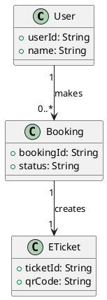
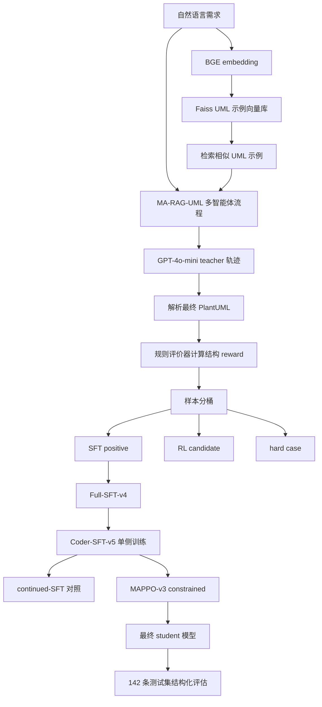

# ReMA-RAG 项目算法、实验与结论完整总结

本文档用于完整总结本项目的算法设计、融合路线、实验过程、实验结果与结论。它比 PPT 摘要更详细，适合用于课程结项报告、答辩准备、项目经历复盘，也可以作为后续毕业设计或论文工作的基础说明。

本文档重点回答以下问题：

1. 我们到底做了一个什么项目；
2. MA-RAG 和 MMOA-RAG 分别被我们借鉴了什么；
3. 我们的算法融合和两个源项目相比有什么区别；
4. 训练数据是如何构造的；
5. SFT 各版本有什么区别，尤其是 Coder 智能体单侧训练做了什么；
6. MAPPO / PPO 风格后训练具体优化了什么；
7. 做了哪些基线实验和消融实验；
8. 实验结果说明了什么；
9. 当前工作有哪些局限，后续应该如何继续优化。

---

## 1. 项目总体概述

### 1.1 项目任务

本项目研究的是：

```text
自然语言软件需求描述 -> PlantUML 类图代码
```

输入是一段自然语言需求，例如：

```text
Users can book tickets. Each successful booking creates an e-ticket with a QR code.
```

输出是结构化的 PlantUML 类图代码，例如：



这个任务的难点在于，它不是普通文本生成任务，而是结构化软件建模任务。模型不仅要生成通顺文本，还必须正确生成：

- 类名；
- 属性名；
- 属性类型；
- 方法；
- 类之间关系；
- 关系标签；
- 多重性；
- PlantUML 语法格式。

因此，传统自然语言问答中的 Exact Match 或普通文本 F1 不能直接用于评价，需要重新设计面向 UML 结构的评价指标。

### 1.2 项目核心方法

我们构建的系统可以称为 **ReMA-RAG**。它的核心思想是：

> 使用 MA-RAG 的多智能体 RAG 推理流程生成 UML 类图，再借鉴 MMOA-RAG 的 SFT + 强化学习后训练范式，对 Llama3-8B-Instruct 进行 LoRA 微调和结构化 reward 优化。

简化后的流程是：

```text
PlantUML 数据集
-> UML 示例向量库
-> GPT-4o-mini MA-RAG-UML teacher 生成轨迹
-> 规则评价器打分并分桶
-> Llama3-8B-Instruct LoRA SFT
-> Coder 智能体单侧继续训练
-> MAPPO/PPO 风格结构 reward 后训练
-> 结构化 UML 指标评估
```

### 1.3 一句话结论

从实验结果看：

- **SFT 是主要性能提升来源**；
- **Coder 智能体单侧训练进一步提升属性、关系标签和多重性等细粒度结构指标**；
- **MAPPO-v3 constrained 在 Coder-SFT-v5 基础上有小幅进一步提升，但不是主要提升来源**；
- **当前强化学习提升有限，主要受限于 teacher 数据质量、rule reward 噪声和 agent-level credit assignment 不充分**。

---

## 2. 参考工作与源项目

### 2.1 MA-RAG

参考论文：

- **MA-RAG: Multi-Agent Retrieval-Augmented Generation via Collaborative Chain-of-Thought Reasoning**
- 论文链接：https://arxiv.org/abs/2505.20096
- 代码链接：https://github.com/thangylvp/MA-RAG

MA-RAG 原本是一个面向开放域问答任务的多智能体 RAG 框架。其核心不是某一个具体数据集，而是多 agent 协同推理流程。

MA-RAG 中的典型角色包括：

| Agent | 原始作用 |
|---|---|
| Planner | 对问题进行分解，规划推理步骤 |
| Step Definer | 定义每个推理步骤需要完成的子任务 |
| Extractor | 从检索到的文档中抽取有用信息 |
| Coder / Executor | 根据前面步骤生成最终答案 |

本项目借鉴 MA-RAG 的地方主要是：

1. 多智能体分工；
2. 检索增强生成；
3. 多步中间轨迹；
4. teacher 生成可记录的推理过程。

### 2.2 MMOA-RAG

参考论文：

- **Improving Retrieval-Augmented Generation through Multi-Agent Reinforcement Learning**
- 论文链接：https://arxiv.org/abs/2501.15228
- 代码链接：https://github.com/chenyiqun/MMOA-RAG

MMOA-RAG 原本面向 HotpotQA 等问答任务。它将 RAG 流程拆分为多个 agent，例如：

| Agent | 原始作用 |
|---|---|
| Query Rewrite | 改写查询 |
| Document Selector | 选择文档 |
| Answer Generator | 生成答案 |

MMOA-RAG 的训练思路是：

1. 先用监督微调让各个 agent 学会基本行为；
2. 再使用 PPO/MAPPO 风格强化学习，通过 reward 优化多智能体协作质量。

本项目借鉴 MMOA-RAG 的地方主要是：

1. SFT 热身；
2. 强化学习后训练；
3. value head / reward trace / PPO 风格优化流程；
4. 多智能体 RAG 不只依赖 prompt，而可以通过训练进一步优化。

---

## 3. 本项目与两个源项目的区别

### 3.1 与 MA-RAG 的区别

MA-RAG 原任务是开放域问答，本项目任务是 PlantUML 类图生成。

| 维度 | MA-RAG 原项目 | 本项目 |
|---|---|---|
| 输入 | 自然语言问题 | 软件需求描述 |
| 检索对象 | 文档片段 | UML / PlantUML 示例 |
| 输出 | 自然语言答案 | PlantUML 类图代码 |
| 评价方式 | QA EM / F1 | UML 结构匹配指标 |
| agent 目标 | 协作回答问题 | 协作抽取并生成 UML 结构 |

因此，本项目不是简单把 MA-RAG 代码跑一遍，而是做了任务迁移：

1. 将问答 prompt 改为 UML 建模 prompt；
2. 将检索库改为 UML 示例向量库；
3. 将最终输出格式改为 PlantUML；
4. 将评价指标从答案匹配改为结构匹配；
5. 将错误分析重点从答案错误转为类、属性、关系、多重性错误。

### 3.2 与 MMOA-RAG 的区别

MMOA-RAG 原任务是 HotpotQA 问答，本项目任务是 PlantUML 类图生成。

| 维度 | MMOA-RAG 原项目 | 本项目 |
|---|---|---|
| agent 类型 | Query Rewrite / Selector / Generator | Planner / Step Definer / Extractor / Coder |
| reward 来源 | QA 答案正确性 | UML 结构相似度 |
| 检索服务 | Wikipedia / HotpotQA 语料 | UML 示例向量库 |
| 输出 | 文本答案 | PlantUML 类图 |
| 主要指标 | EM / F1 | Class / Attr / Method / Relation / Multiplicity F1 |

需要特别说明：

> 当前项目并不是完整复刻 MMOA-RAG 在 HotpotQA 上的全量 MAPPO 训练，而是将其“SFT 热身 + reward-guided 后训练”的思想迁移到 PlantUML 类图生成任务。当前 MAPPO-v3 constrained 主要针对最终 PlantUML 输出进行结构化 reward 后训练，尚未完全实现 Planner、Step Definer、Extractor、Coder 四个 agent 的独立 actor 和独立 credit assignment。

这个表述很重要。答辩时不建议说“我们完整实现了多 agent MAPPO”，更稳妥的说法是：

```text
我们实现了 MAPPO/PPO 风格的结构化 reward 后训练，并尝试了 agent-aware credit assignment 的初步版本。
```

---

## 4. ReMA-RAG 算法融合路线

### 4.1 总体融合思路

本项目融合不是简单地把两个代码仓库拼接起来，而是做了三层融合：

1. **任务层融合**  
   将 MA-RAG 的多智能体 RAG 从问答任务迁移到 PlantUML 类图生成任务。

2. **数据层融合**  
   用 MA-RAG-UML teacher 生成多智能体轨迹，再将轨迹转换为 SFT 数据和 RL candidate 数据。

3. **训练层融合**  
   借鉴 MMOA-RAG 的 SFT + MAPPO 思路，对 Llama3-8B-Instruct 进行 LoRA SFT 和结构化 reward 后训练。

### 4.2 总体流程图



### 4.3 四个 agent 在 UML 任务中的职责

| Agent | 本项目中的职责 | 主要影响指标 |
|---|---|---|
| Planner | 根据需求规划应该有哪些类、模块、核心对象 | Class F1 |
| Step Definer | 决定需要抽取哪些属性、方法、关系和多重性 | Attr F1 / Method F1 / Relation F1 |
| Extractor | 从需求和检索示例中抽取具体 UML 元素 | Class / Attr / Relation |
| Coder | 将中间结构转换为最终 PlantUML 代码 | Format / Syntax / 全部结构指标 |

项目后期发现，最终 PlantUML 的质量很大程度取决于 Coder 能否把前面步骤的信息稳定转成规范代码。因此我们专门做了 Coder 智能体单侧训练，也就是 Coder-SFT-v5。

---

## 5. 数据工程与训练数据构建

### 5.1 原始数据

项目使用 PlantUCD / PlantUML 类图相关数据。每条样本一般包含：

- 自然语言需求描述；
- gold PlantUML 类图；
- 可检索的 UML 示例。

最终测试集为 142 条，用于所有主结果评估。

### 5.2 UML 示例向量库

为了让 MA-RAG-UML 能够利用相似案例，本项目构建了 UML 示例向量库：

1. 使用 BGE 模型对需求或示例文本编码；
2. 使用 Faiss 建立向量索引；
3. 对每条待生成需求检索相似 UML 示例；
4. 将检索结果作为上下文输入给 teacher agent。

这样做的目的不是让模型凭空生成，而是让它参考结构相近的 UML 类图。

### 5.3 Teacher trajectory 生成

我们使用 GPT-4o-mini 作为 teacher，运行 MA-RAG-UML 多智能体流程。

每条 trajectory 记录的信息包括：

- 样本 id；
- 输入需求；
- 检索到的相关 UML 示例；
- Planner 输出；
- Step Definer 输出；
- Extractor 输出；
- Coder 最终 PlantUML；
- gold PlantUML；
- rule reward 评估结果。

这些 trajectory 不是直接作为最终结果，而是进一步转成训练数据。

### 5.4 轨迹数据分桶

用 rule reward 对 teacher 生成结果打分后，将样本分为：

| 分桶 | 含义 | 用途 |
|---|---|---|
| SFT positive | 高 reward、高质量样本 | 监督微调 |
| RL candidate | 中等质量、可优化样本 | MAPPO/PPO 后训练 |
| hard case | 低质量或失败样本 | 误差分析、后续数据修复 |

这一设计的动机是：

- 高质量样本适合模仿；
- 中等质量样本适合通过 reward 继续优化；
- 低质量样本直接训练可能污染模型，因此主要用于分析。

### 5.5 训练样本不是简单等于原始样本数

需要注意，SFT 样本数量不一定等于原始需求条数。

原因是：一条 MA-RAG-UML trajectory 可以被展开成不同形式的训练样本，例如：

1. end-to-end 输入需求到最终 PlantUML；
2. 带检索上下文的输入到最终 PlantUML；
3. Coder 输入到 Coder 输出；
4. agent-aware 版本中的中间 agent 输入输出。

因此，训练集规模是由“原始 trajectory 数量”和“转换脚本如何展开 trajectory”共同决定的。

---

## 6. SFT 方法设计：不同版本到底有什么区别

SFT 是本项目最重要的训练阶段。我们不是只跑了一次 SFT，而是围绕“训练什么输出、训练哪个角色、如何排除额外训练的影响”做了多个版本。

### 6.1 Full-SFT-v4：端到端学生模型基线

**目的：**

建立 Llama3-8B-Instruct 的主要 student baseline，让模型从 teacher trajectory 中学习自然语言需求到 PlantUML 的基本映射。

**训练方式：**

- 基座模型：Llama3-8B-Instruct；
- 训练方式：LoRA SFT；
- 训练数据：由高质量 teacher trajectory 转换得到的 SFT 数据；
- 输出目标：最终 PlantUML 类图代码。

**它学习的内容：**

1. PlantUML 基本格式；
2. 类定义方式；
3. 属性和方法写法；
4. 类间关系；
5. 从需求中抽取结构的基本模式。

**实验意义：**

Full-SFT-v4 是后续所有学生模型训练的核心基准。它回答的问题是：

```text
teacher trajectory 蒸馏到 Llama3-8B-Instruct 是否有效？
```

结果显示非常有效：

```text
Llama3 zero-shot Total = 0.374
Full-SFT-v4 Total      = 0.607
```

这说明 SFT 是主要提升来源。

### 6.2 Coder-SFT-v5：Coder 智能体单侧训练

**这是本项目很重要的一步，上一版文档写得不够详细。**

Full-SFT-v4 是端到端训练，而 Coder-SFT-v5 更关注最终 Coder 输出。它不是简单再训练一遍，而是对 Coder 智能体进行单侧强化。

**为什么要做 Coder 单侧训练？**

在 UML 生成任务中，最终质量高度依赖 Coder：

- 前面的 Planner / Extractor 可能已经找到了类和关系；
- 但如果 Coder 没有正确写成 PlantUML，最终指标仍然低；
- 属性格式、关系标签、多重性等细节基本都在 Coder 输出阶段体现。

因此我们设计了 Coder-SFT-v5：

```text
Full-SFT-v4
-> 继续用 Coder / final PlantUML 相关高质量样本训练
-> 强化最终代码生成能力
```

**它和 Full-SFT-v4 的区别：**

| 维度 | Full-SFT-v4 | Coder-SFT-v5 |
|---|---|---|
| 训练目标 | 端到端需求到 PlantUML | 更强调 Coder / final PlantUML 输出 |
| 主要作用 | 建立整体 UML 生成能力 | 修正属性、关系标签、多重性等代码层细节 |
| 影响指标 | Total、Class、RelPair 大幅提升 | Attr、RelLabel、Mult 更明显提升 |
| 性质 | 主 SFT baseline | Coder 智能体单侧继续训练 |

**实验结果：**

```text
Full-SFT-v4  Total = 0.607
Coder-SFT-v5 Total = 0.614
```

Coder-SFT-v5 相比 Full-SFT-v4：

- Attribute F1 从 0.714 提升到 0.769；
- Relation Label F1 从 0.262 提升到 0.321；
- Multiplicity F1 从 0.432 提升到 0.456；
- Total 从 0.607 提升到 0.614；
- Class F1 和 RelPair F1 略有下降。

**结论：**

Coder 单侧训练确实有效，尤其是对最终 PlantUML 代码细节有效。但它也说明一个现象：只强化 Coder 可能会牺牲一部分类覆盖或关系端点稳定性，因此后续需要更好的 agent-level coordination，而不是只训练 Coder。

### 6.3 Continued-SFT tiny64：公平性对照

老师提到实验公平性问题后，我们补充了 continued-SFT tiny64。

**为什么需要这个实验？**

MAPPO-v3 tiny64 相比 Coder-SFT-v5 有提升，但必须排除一种可能：

```text
提升是不是只是因为模型又多训练了一点，而不是 reward 起作用？
```

因此我们设计了 continued-SFT tiny64：

- 从 Coder-SFT-v5 出发；
- 使用与 MAPPO tiny64 可比的小规模样本；
- 不使用 RL reward；
- 只继续做普通 SFT。

**对比结果：**

```text
Coder-SFT-v5         Total = 0.614
Continued-SFT tiny64 Total = 0.616
MAPPO-v3 tiny64      Total = 0.618
```

**结论：**

continued-SFT 本身确实能带来一点点提升，但提升小于 MAPPO-v3。说明 MAPPO-v3 的提升不是完全来自“多训练”，reward-guided 后训练仍然有一点额外贡献。

不过这个额外贡献很小，因此不能夸大。

### 6.4 Coder-SFT-v6：结构约束负向实验

我们还尝试过 Coder-SFT-v6，希望通过更强的结构约束进一步提升模型。

但结果显示 Coder-SFT-v6 低于 Coder-SFT-v5。

**这个实验说明：**

1. PlantUML 生成不是约束越强越好；
2. 过度强调某些结构格式可能损害整体生成能力；
3. 数据质量和 reward 设计比简单加约束更重要。

因此 Coder-SFT-v6 不作为最终主结果，而作为负向消融。

### 6.5 Agent-aware SFT v0：简单拆 agent 的负向实验

我们还尝试了 agent-aware SFT v0，也就是把中间 agent 输出纳入训练，希望更贴近多智能体协作。

但结果不如 Coder-SFT-v5。

**这说明：**

简单把 Planner、Step Definer、Extractor、Coder 的输出都拿来训练，并不一定提升最终 PlantUML 质量。原因可能是：

- 中间 agent 输出格式不够稳定；
- 中间监督和最终指标之间没有直接对应；
- Coder 才是最终代码质量瓶颈；
- 没有真正做到每个 agent 的 credit assignment。

这个实验的价值是：它证明了“agent-level credit assignment”不是简单把中间输出加入 SFT 就能解决的，后续需要更精细的 reward 分配。

---

## 7. Reward 与结构化评价器设计

### 7.1 为什么不用 EM/F1 问答指标

PlantUML 代码存在大量等价表达：

```plantuml
User --> Booking
```

和：

```plantuml
Booking <-- User
```

在语义上可能接近，但字符串完全不同。

因此不能直接用字符串 Exact Match。我们需要先解析 PlantUML，再比较结构。

### 7.2 评价指标

本项目使用结构化指标：

| 指标 | 含义 |
|---|---|
| Format Score | 是否包含合法 PlantUML 框架 |
| Syntax Score | PlantUML 是否可解析 |
| Class F1 | 类集合匹配程度 |
| Attribute F1 | 属性集合匹配程度 |
| Method F1 | 方法集合匹配程度 |
| Relation Pair F1 | 关系两端类是否匹配 |
| Relation Label F1 | 关系标签是否匹配 |
| Multiplicity F1 | 多重性是否匹配 |
| Total | 综合结构分数 |

### 7.3 strict 与 normalized

评估中有 strict mean 和 normalized mean。

**strict mean** 更严格，直接按原始解析结果计算。

**normalized mean** 会做一些格式归一化，例如属性类型位置差异：

```plantuml
+String name
```

和：

```plantuml
+name: String
```

在 PlantUML 中都可能表达属性，但 gold 数据更偏向后者。前期人工审核时也发现很多模型输出把类型写在前面，因此 normalized evaluation 用于减少纯格式差异造成的误判。

主表使用 normalized mean，更适合反映结构语义相似度。

### 7.4 Reward 用在哪里

Reward 有两个用途：

1. **离线评估**  
   对所有模型输出打分，得到 Total、Class、Attr 等指标。

2. **MAPPO/PPO 风格后训练**  
   在后训练阶段，模型生成 PlantUML 后，用 rule reward 给反馈，更新模型。

### 7.5 当前 reward 的局限

当前 reward 主要基于最终输出，因此它能告诉模型：

```text
最终 PlantUML 好不好
```

但很难告诉模型：

```text
到底是 Planner 错了，Extractor 错了，还是 Coder 写错了
```

这就是当前 MAPPO 提升有限的重要原因之一。

---

## 8. MAPPO/PPO 风格后训练设计

### 8.1 为什么要做强化学习后训练

SFT 只能模仿 teacher，如果 teacher 或训练样本存在问题，模型可能学到不稳定模式。

强化学习后训练的目标是：

- 不只模仿 teacher；
- 让模型根据结构 reward 调整输出；
- 优化 SFT 不容易直接强调的细节，例如关系标签、多重性。

### 8.2 当前实现方式

当前 MAPPO-v3 constrained 的实现可以概括为：

```text
初始化模型：Coder-SFT-v5
训练数据：RL candidate / tiny64 或 tiny128
反馈信号：UML rule reward
优化目标：提高最终 PlantUML 结构分数
产物：LoRA adapter + value head + reward trace + loss/reward 曲线
```

它借鉴了 MMOA-RAG 的训练流程，但当前不是完整多 agent 独立 actor 训练。

更准确的表述：

```text
MAPPO/PPO-style structural reward post-training
```

### 8.3 MAPPO-v0/v1/v2/v3 的探索

我们不是一次就得到 v3，而是逐步调整：

| 版本 | 作用 | 结论 |
|---|---|---|
| MAPPO-v0 tiny32 | 跑通 PlantUML reward 后训练流程 | 能训练，但早期流程和保存逻辑需要修正 |
| MAPPO-v1 tiny32 | 修复训练保存与评估链路 | 可完整训练与评估，但提升很小 |
| MAPPO-v2 tiny64 | 尝试 delta reward / reward 调整 | 仍不稳定，说明 reward 设计需要更保守 |
| MAPPO-v3 tiny64 | constrained reward 后训练 | 当前最佳 student 结果 |
| MAPPO-v3 tiny128 | 扩大样本规模 | 未超过 tiny64，说明简单扩样本不一定有效 |

### 8.4 为什么 MAPPO reward 曲线波动大

MAPPO reward 曲线波动大是正常现象，原因包括：

1. UML reward 是离散结构分数，不像连续回归任务平滑；
2. 每条样本难度差异很大；
3. tiny64 / tiny128 样本规模小；
4. 一处关系错误可能导致多个指标同时下降；
5. 当前 reward 没有分阶段给 Planner、Extractor、Coder 局部反馈。

因此，PPT 中可以放 reward 曲线，但解释时要说：

```text
reward 曲线显示完成了结构化 reward 后训练过程，但由于 UML 任务 reward 稀疏且样本规模较小，波动较明显。最终是否有效主要看测试集结构指标，而不是单看训练 reward 是否平滑。
```

---

## 9. 实验体系：哪些是 baseline，哪些是 ablation

### 9.1 Baseline

| Baseline | 作用 |
|---|---|
| Llama3-8B-Instruct zero-shot | 开源学生模型未训练下限 |
| GPT-4o-mini direct | 强闭源模型直接生成基线 |
| GPT-4o-mini MA-RAG-UML teacher | 强 teacher + MA-RAG 上限参考 |
| Full-SFT-v4 | Llama student 训练基准 |

### 9.2 Ablation

| Ablation | 对比 | 目的 |
|---|---|---|
| SFT ablation | zero-shot vs Full-SFT-v4 | 验证 SFT 是否有效 |
| Coder 单侧训练 ablation | Full-SFT-v4 vs Coder-SFT-v5 | 验证 Coder-focused 训练是否有效 |
| Continued-SFT control | Coder-SFT-v5 vs continued-SFT tiny64 | 排除只是多训练导致的提升 |
| RL ablation | continued-SFT tiny64 vs MAPPO-v3 tiny64 | 验证 reward 后训练是否有额外贡献 |
| RL scale ablation | MAPPO-v3 tiny64 vs tiny128 | 验证扩大 RL 样本是否有效 |
| Structure constraint ablation | Coder-SFT-v5 vs Coder-SFT-v6 | 验证更强结构约束是否有效 |
| Agent-aware ablation | Coder-SFT-v5 vs agent-aware SFT v0 | 验证简单 agent-aware 监督是否有效 |

---

## 10. 最终主结果

以下为 142 条测试集上的 normalized mean。

| 模型/版本 | Total | Class | Attr | Method | RelPair | RelLabel | Mult |
|---|---:|---:|---:|---:|---:|---:|---:|
| Llama3-8B-Instruct zero-shot | 0.374 | 0.813 | 0.425 | 0.587 | 0.121 | 0.176 | 0.433 |
| GPT-4o-mini direct | 0.540 | 0.816 | 0.618 | 0.651 | 0.543 | 0.172 | 0.432 |
| Full-SFT-v4 | 0.607 | 0.838 | 0.714 | 0.682 | 0.603 | 0.262 | 0.432 |
| Coder-SFT-v5 | 0.614 | 0.810 | 0.769 | 0.677 | 0.583 | 0.321 | 0.456 |
| Continued-SFT tiny64 | 0.616 | 0.810 | 0.776 | 0.677 | 0.583 | 0.328 | 0.456 |
| MAPPO-v3 tiny64 | 0.618 | 0.812 | 0.776 | 0.677 | 0.586 | 0.328 | 0.463 |
| MAPPO-v3 tiny128 | 0.613 | 0.811 | 0.763 | 0.677 | 0.583 | 0.317 | 0.456 |
| GPT-4o-mini MA-RAG-UML teacher | 0.631 | 0.861 | 0.600 | 0.710 | 0.675 | 0.373 | 0.469 |

### 10.1 结果解读

第一，Llama3 zero-shot 的 Total 只有 0.374，尤其 RelPair 只有 0.121，说明未训练模型很难稳定生成 UML 关系。

第二，GPT-4o-mini direct 达到 0.540，比 Llama3 zero-shot 高很多，说明强闭源模型具备较强的直接生成能力，但仍然低于训练后的 student。

第三，Full-SFT-v4 达到 0.607，相比 zero-shot 大幅提升，说明 teacher trajectory 蒸馏非常有效。

第四，Coder-SFT-v5 达到 0.614，主要提升 Attr、RelLabel、Mult，说明 Coder 智能体单侧训练有效。

第五，MAPPO-v3 tiny64 达到 0.618，是当前 student 最优结果，但相比 Coder-SFT-v5 提升不大，说明 RL 后训练有额外贡献但幅度有限。

第六，GPT-4o-mini MA-RAG-UML teacher 达到 0.631，是当前 teacher 上限参考。student 尚未超过 teacher，但已经接近 teacher。

---

## 11. Pairwise 结果与更细分析

### 11.1 Coder-SFT-v5 vs Full-SFT-v4

Pairwise：

```text
wins  = 52
losses = 35
ties  = 55
```

平均变化：

- Total +0.007；
- Attribute +0.054；
- Relation Label +0.059；
- Multiplicity +0.024；
- Class 和 RelPair 略降。

结论：

Coder 单侧训练不是全面提升所有指标，而是明显改善 Coder 输出相关的细节指标。这符合它的设计目标。

### 11.2 Continued-SFT tiny64 vs Coder-SFT-v5

Pairwise：

```text
wins  = 2
losses = 2
ties  = 138
```

平均变化：

- Total +0.0019；
- Attribute +0.0071；
- Relation Label +0.0070。

结论：

继续普通 SFT 的收益很小，说明模型已经接近该数据下 SFT 的饱和状态。

### 11.3 MAPPO-v3 tiny64 vs Coder-SFT-v5

Pairwise：

```text
wins  = 3
losses = 1
ties  = 138
```

平均变化：

- Total +0.0042；
- Class +0.0023；
- Attribute +0.0077；
- RelPair +0.0035；
- RelLabel +0.0070；
- Multiplicity +0.0070。

结论：

MAPPO-v3 tiny64 的提升很小，但方向比较一致。它没有改变大多数样本，但在少量样本上修正了结构细节。

这说明当前 RL 的作用是“细粒度修正”，不是“主要能力来源”。

### 11.4 MAPPO-v3 tiny128 为什么没有更好

MAPPO-v3 tiny128 Total 为 0.613，低于 tiny64 的 0.618。

这说明：

1. RL 样本不是越多越好；
2. RL candidate 内部质量差异较大；
3. 低质量样本可能带来噪声；
4. reward 对 hard case 的指导不够精细；
5. 当前缺少难度分桶采样和 agent-level credit assignment。

---

## 12. 主要实验结论

### 12.1 SFT 是主提升来源

最重要结论：

```text
Llama3 zero-shot -> Full-SFT-v4
0.374 -> 0.607
```

这说明 teacher trajectory 蒸馏是有效的，也说明开源模型在该任务上需要训练。

### 12.2 Coder 单侧训练有效

Coder-SFT-v5 的设计是合理的，因为最终 PlantUML 质量主要由 Coder 输出决定。

它带来的主要提升在：

- 属性；
- 关系标签；
- 多重性；
- 最终代码格式稳定性。

### 12.3 MAPPO 有作用，但不是主要贡献

MAPPO-v3 tiny64 是当前 student 最优，但提升幅度小：

```text
Coder-SFT-v5 -> MAPPO-v3 tiny64
0.614 -> 0.618
```

这说明结构化 reward 有一定作用，但当前实现仍受限。

答辩时不能夸大为：

```text
MAPPO 显著提升模型性能
```

更稳妥表述：

```text
MAPPO-v3 constrained 在 SFT 基础上带来了小幅但方向明确的结构细节优化，说明 rule reward 后训练具有可行性，但当前主要性能来源仍是 SFT。
```

### 12.4 GPT-4o-mini teacher 是上限参考，不是公平训练对比

GPT-4o-mini MA-RAG-UML teacher Total 为 0.631，高于 student 最优 0.618。

但它不是 LoRA 微调后的模型，因此不应与 Llama student 作为完全公平训练对比。

它的作用是：

- 说明 teacher 轨迹质量上限；
- 说明 student 仍有提升空间；
- 证明 MA-RAG-UML teacher 流程本身有效。

### 12.5 Agent-aware v0 的失败是有价值的

agent-aware SFT v0 没有超过 Coder-SFT-v5，并不是无意义实验。它说明：

- 多智能体结构不能只靠把中间输出加入 SFT；
- 需要更精细的 credit assignment；
- 当前最终输出 Coder 仍是最关键瓶颈。

---

## 13. 当前局限

### 13.1 数据质量问题

Teacher trajectory 由 GPT-4o-mini 自动生成，存在：

- 类遗漏；
- 属性类型错误；
- 属性格式不统一；
- 冗余类；
- 关系方向错误；
- 关系标签不准确；
- 多重性缺失。

数据质量直接影响 SFT 和 MAPPO。

### 13.2 Reward 噪声

PlantUML 有多种合法表达方式，规则评价器可能误伤语义正确但格式不同的结果。

例如：

```plantuml
+String name
```

和：

```plantuml
+name: String
```

可能表达相同属性，但 strict 评价会更严格。

### 13.3 Reward 稀疏

当前 reward 主要来自最终 PlantUML 结构，不能充分反映每个中间 agent 的贡献。

因此模型只知道最终分数高低，不知道是哪一步做错。

### 13.4 MAPPO 规模较小

当前 MAPPO 是 tiny64 / tiny128 级别验证，主要证明可行性，不是大规模强化学习训练。

### 13.5 Agent-level credit assignment 未完全实现

真正理想的设计应该是：

| Agent | 应接收的局部 reward |
|---|---|
| Planner | 类覆盖、核心对象规划 |
| Step Definer | 关系类型、多重性规划 |
| Extractor | 属性、方法、关系抽取 |
| Coder | syntax、format、最终结构 |

当前项目只做了初步探索，还没有完整实现。

---

## 14. 如果继续做论文或毕业设计，应该怎么改

### 14.1 优先改数据

当前最值得做的是提升训练数据质量，而不是盲目扩大 RL 样本。

建议：

1. 对 hard case 用更强 teacher 重新生成；
2. 人工审核一部分高价值样本；
3. 统一属性格式；
4. 过滤明显错误 trajectory；
5. 建立更稳定的 relation / multiplicity 标注规则。

### 14.2 改 reward

后续 reward 应该从最终输出 reward 变成 dense reward：

```text
class reward
attribute reward
method reward
relation reward
syntax reward
format reward
```

并进一步分配到不同 agent。

### 14.3 做真正 agent-level credit assignment

后续可以设计：

1. 每个 agent 输出结构化 JSON；
2. 每个 JSON 字段对应局部指标；
3. 最终 PlantUML 错误可追溯到中间 agent；
4. 使用 centralized critic 或共享 value head；
5. 分别更新不同 agent 的策略。

### 14.4 做更公平的实验

如果要写论文，建议补：

- 多 seed；
- reward component ablation；
- 不同 student backbone；
- 不同 teacher model；
- human evaluation；
- 更大测试集。

---

## 15. 答辩中可以怎么说

### 15.1 方法介绍

可以说：

> 本项目提出 ReMA-RAG，将 MA-RAG 的多智能体检索增强推理流程迁移到 PlantUML 类图生成任务，并借鉴 MMOA-RAG 的 SFT + 强化学习后训练范式。我们首先使用 GPT-4o-mini 作为 teacher 生成多智能体 UML 轨迹，再将轨迹蒸馏到 Llama3-8B-Instruct，之后通过 Coder 智能体单侧训练和结构化 reward 后训练优化最终 PlantUML 质量。

### 15.2 实验结果

可以说：

> 实验显示，SFT 是主要提升来源，Llama3-8B-Instruct zero-shot 的 Total 为 0.374，Full-SFT-v4 提升到 0.607。进一步的 Coder-SFT-v5 提升到 0.614，主要改善属性、关系标签和多重性。MAPPO-v3 tiny64 进一步达到 0.618，说明结构化 reward 后训练可以带来小幅细粒度优化。

### 15.3 局限

可以说：

> 当前 MAPPO 提升幅度不大，主要原因是 teacher 自动生成数据存在噪声，UML 结构 reward 较稀疏，并且当前 reward 主要作用于最终输出，尚未完全实现多 agent 的 credit assignment。因此后续工作会重点改进数据质量、dense reward 和 agent-level reward 分配。

### 15.4 不建议说的话

不建议说：

```text
我们完整实现了 MMOA-RAG 的 MAPPO。
```

更建议说：

```text
我们实现了 MAPPO/PPO 风格的结构化 reward 后训练，并探索了 agent-level credit assignment 的初步方案。
```

不建议说：

```text
MAPPO 大幅提升性能。
```

更建议说：

```text
MAPPO 在 SFT 基础上带来了小幅但方向明确的结构细节提升。
```

---

## 16. 本项目体现的主要工作量

本项目工作量不只是训练一个模型，而是包括以下完整链路：

1. 阅读和理解 MA-RAG、MMOA-RAG 两篇论文；
2. 在 HotpotQA 上复现 MMOA-RAG debug 和 1000 条小规模实验；
3. 将 MA-RAG 从问答任务迁移到 PlantUML 类图生成；
4. 构建 UML 示例向量库；
5. 使用 GPT-4o-mini 生成 teacher trajectory；
6. 编写 trajectory 转换脚本；
7. 设计 rule reward 和结构化评价器；
8. 人工审核部分错误样本；
9. 构造 SFT positive、RL candidate、hard case；
10. 训练 Full-SFT-v4；
11. 训练 Coder-SFT-v5，实现 Coder 智能体单侧训练；
12. 训练 Coder-SFT-v6，验证结构约束负向结果；
13. 补 continued-SFT tiny64，验证实验公平性；
14. 跑 MAPPO-v0/v1/v2/v3 多个后训练版本；
15. 跑 MAPPO-v3 tiny64 和 tiny128；
16. 尝试 agent-aware SFT v0；
17. 补 Llama zero-shot、GPT-4o-mini direct、GPT-4o-mini teacher baseline；
18. 进行 pairwise 对比和误差分析；
19. 整理训练曲线、reward 曲线、评估表格和 case analysis。

这条链路完整覆盖了：

```text
数据构建 -> teacher 轨迹 -> SFT -> 单侧 agent 训练 -> RL 后训练 -> 消融实验 -> 误差分析
```

---

## 17. 最终结论

本项目最终形成了一个完整的多智能体 RAG + 结构化训练优化系统。

从算法上看，本项目完成了：

1. MA-RAG 到 PlantUML 类图生成任务的迁移；
2. GPT-4o-mini teacher trajectory 到 Llama3-8B-Instruct 的蒸馏；
3. Full-SFT 到 Coder 单侧 SFT 的训练细化；
4. 结构化 rule reward 的设计和评估；
5. MAPPO/PPO 风格后训练的可行性验证；
6. agent-aware credit assignment 的初步负向探索。

从实验上看，本项目得到的结论是：

1. 直接 zero-shot 生成不足以完成高质量 UML 类图生成；
2. SFT 可以显著提升学生模型；
3. Coder 单侧训练可以改善最终代码细节；
4. MAPPO-v3 constrained 可以带来小幅额外提升；
5. 简单扩大 RL 样本或简单拆 agent 训练不一定有效；
6. 后续真正突破点在于数据质量、dense reward 和 agent-level credit assignment。

因此，本项目不是只做了一个“跑模型”的课程实验，而是完成了一条较完整的算法研究闭环：

```text
问题定义
-> 源论文复现
-> 方法迁移
-> 数据构建
-> SFT 训练
-> Coder 单侧训练
-> Reward 后训练
-> 消融实验
-> 误差分析
-> 局限与后续方向
```

